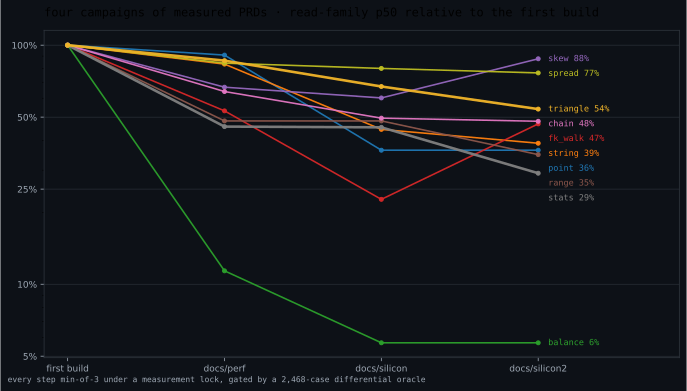

# bumbledb

An embedded, typed, **set-semantic** relational database for Rust, built on
LMDB, executing conjunctive queries with **Free Join** — and tuned, one
measured PRD at a time, for Apple Silicon.

There is no SQL and no interpreter in the hot path. You declare a schema with
a macro, write plain structs, and run conjunctive queries (joins,
comparisons, aggregates) that are planned once and executed over columnar
in-memory images with a lazy trie join. Results are sets. Everything the
engine claims about performance is a pinned, reproducible measurement with a
differential oracle standing behind it.

```rust
bumbledb::schema! {
    relation Holder {
        id: u64 as HolderId, serial,
        name: str,
        region: enum Region { Na, Eu, Apac, Latam },
    }
    relation Account {
        id: u64 as AccountId, serial,
        holder: u64 as HolderId, fk(Holder.id),
        status: enum Status { Open, Frozen, Closed },
        opened_at: i64,
    }
}

let db = bumbledb::Db::create(path, schema())?;

// Writes are set arithmetic on an in-memory delta; constraints are checked
// at commit against the final state — an abort never touched disk.
db.write(|tx| {
    let holder: HolderId = tx.alloc();
    tx.insert(&Holder { id: holder, name: "alice".into(), region: Region::Eu })?;
    tx.insert(&Account { id: tx.alloc(), holder, status: Status::Open, opened_at: 17_000_000 })?;
    Ok(())
})?;

// Queries are prepared once, executed on snapshots into a reusable buffer —
// zero allocations per execution after warmup.
let q = db.prepare(&query)?;   // ir::Query: conjunctive atoms + predicates + finds
db.read(|snap| {
    snap.execute(&q, &params, &mut results)?;
    Ok(())
})?;
```

Newtypes are the nominal-safety layer: `HolderId` and `AccountId` are
distinct host types, and mixing them is a **compile error** — the database's
type discipline is enforced by rustc, not by runtime checks.

## The numbers

Same corpus, same queries, results verified identical against SQLite by a
2,468-case differential oracle before any timing is believed:


Those constants weren't free — they're the residue of four optimization
campaigns (~40 measured PRDs), each change gated on min-of-3 timing under a
machine-wide measurement lock, with clock-frequency bracketing to reject
contaminated runs:



And the honest chart — durable writes are an fsync-latency product on both
engines, and bulk load favors SQLite's write path; we publish it anyway:


**Context that keeps these numbers honest:** S-scale ledger corpus (10⁵-row
fact table), Apple M2 Max, engine-favorable workload class (point lookups
through multi-way joins and aggregates — exactly what a set-semantic Free
Join engine is built for). SQLite is measured warm, prepared, and
well-indexed on the identical data. This is a research engine validated at
this scale, not a production database. Regenerate everything yourself:

```sh
cargo build --release -p bumbledb-bench
target/release/bumbledb-bench gen && target/release/bumbledb-bench verify
target/release/bumbledb-bench bench --out bench-out/run1   # ×3
python3 scripts/bench_viz.py bench-out/run1 bench-out/run2 bench-out/run3
```

## Why it's fast

Three design decisions do most of the work; the microarchitecture campaigns
did the rest.

1. **Representation over control flow.** Relations live as columnar images
   (decoded once per generation, cached); queries run over a lazy trie
   (COLT) that materializes exactly the levels a join actually probes.
   Nothing is interpreted per row.
2. **Batched, two-phase execution.** The executor probes in batches of ~128:
   phase one computes all hashes (pure ALU), phase two issues all bucket
   loads as independent chains that fill the M-series' ~28 outstanding-miss
   lanes. Misses become branchless survivor compaction, never per-tuple
   control flow.
3. **Set semantics end to end.** No duplicate bookkeeping, no ordering
   obligations, idempotent writes — the algebra removes work before the
   machine ever sees it.

On top of that sit the six microarchitectural mechanisms that survived
measurement (bucket-of-8 tag-byte maps at occupancy-invariant load factors,
SWAR window probes, const-generic key monomorphization, one software-prefetch
pass, alias-hoisted loops, and a single run-coherence memo) — and, just as
deliberately, a graveyard of mechanisms that were built, measured, refuted,
and deleted. Every surviving optimization carries a citation to its measured
win at its site; **"it was in a PRD" is not a defense** — two of the last
campaign's own features were deleted by its final audit.

## Architecture

The design is documented before it is code. Five earlier implementations
(v1–v5) were built and discarded; the current engine was rebuilt docs-first,
decision by decision, from the documents below (the reset and its motivating
review live in git history at `1b65ae8`). When code and these docs disagree,
one of them is wrong and the repo is broken until they agree.

| doc | what it owns |
|---|---|
| [00 — Product](docs/architecture/00-product.md) | what bumbledb is and refuses to be; the unsafe policy; the simplicity doctrine |
| [10 — Data Model](docs/architecture/10-data-model.md) | typed relations, set semantics, serials, interning, constraints |
| [20 — Query IR](docs/architecture/20-query-ir.md) | conjunctive queries as data: atoms, predicates, finds, aggregates |
| [30 — Execution](docs/architecture/30-execution.md) | Free Join, COLT, batching, the probe laws, the Apple Silicon model |
| [40 — Storage](docs/architecture/40-storage.md) | LMDB layout, generations, commit-time constraint checking |
| [50 — Validation](docs/architecture/50-validation.md) | the differential oracle, the bench ledger, measurement discipline |
| [60 — Embedding API](docs/architecture/60-api.md) | the `schema!` macro, `Db`, transactions, prepared queries |

The algorithmic reference is Wang, Willsey & Suciu, *Free Join: Unifying
Worst-Case Optimal and Traditional Joins* (arXiv:2301.10841), vendored in
[`docs/free-join-paper/`](docs/free-join-paper/).

The performance work is a paper trail, not a changelog:

- [`docs/perf/`](docs/perf/) — campaign one: finish the design's batching, fix the laziness bugs (stats −54%, chain −36%).
- [`docs/silicon/`](docs/silicon/) — campaign two: map geometry, window probes, instruction diet ([final.md](docs/silicon/final.md): geomean −31%, ALL-WIN vs SQLite).
- [`docs/silicon2/`](docs/silicon2/) — campaign three, driven by an eight-experiment microbenchmark fleet: const-arity monomorphization, the bucket-of-8 layout, and **three refutations with full evidence** ([final2.md](docs/silicon2/final2.md): geomean −15% further; [PRD 04](docs/silicon2/04-key-ahead-under-pressure.md) and [PRD 06](docs/silicon2/06-bucket-probe-neon-sweep.md) are the graves; [PRD 10](docs/silicon2/10-resimplify.md) is the audit that made deletion a first-class optimization).

## Measurement discipline

The part of this repo most worth stealing. Performance claims here are gated
by machinery, not judgment:

- **A differential oracle before every timing run**: 2,468 cases (family
  queries plus randomized conjunctive queries) executed on both engines; the
  bench binary refuses to time against an unverified build (per-binary
  stamps).
- **A machine-wide measurement lock** (`scripts/measure.sh`) so two agents'
  runs never overlap, and **clock-proxy bracketing** around every timed block
  — blocks that ran during a DVFS sag or co-tenant interference are flagged
  and excluded, with optional per-sample normalization to adjudicate.
- **Disassembly gates** (`scripts/check-asm.sh`): properties like "the probe
  loop contains no calls and no `bcmp`" are asserted against `objdump`
  output — an `#[inline(always)]` that silently stopped working fails a
  gate, not a code review.
- **Microbench pins**: load-bearing mechanisms carry `#[ignore]`d in-tree
  benchmarks that re-assert their measured margins on demand.
- **Refutation is a result.** When a mechanism measures as a loss, it is
  reverted and its PRD documents the numbers and the mechanism of failure —
  the third campaign's most valuable outputs were an attribution error it
  caught in its own bookkeeping and two textbook cases of isolation wins
  inverting in situ.

## Code style

The tree follows a Rust translation of the [skarnet](https://skarnet.org/software/)
style: every module is a small "header" file (types, constants, invariant
docs — no bodies) plus a directory of leaves, one mechanism per file, tests
quarantined into their own leaves. 375 files, most under 100 lines; the four
former godfiles (`run.rs`, `colt.rs`, `sink.rs`, `prepared.rs` — 10k lines
between them) are now headers you can read in one screen. Doc comments carry
the measurement citations; history lives in `docs/`, never in code comments.

## Repository layout

```
crates/bumbledb/         the engine (LMDB via heed + blake3 are the only deps)
  src/exec/              executor, COLT, sinks, wordmap, NEON kernels
  src/storage/           LMDB env, deltas, commit, interning
  src/api/               Db, transactions, prepared queries
  src/plan/, src/ir/     planner and query IR
crates/bumbledb-macros/  the schema! proc macro (hand-rolled, no syn/quote)
crates/bumbledb-bench/   the oracle + benchmark suite (gen/verify/bench/trace)
docs/                    normative architecture + the campaign paper trail
scripts/                 measure.sh, check-asm.sh, check.sh, bench_viz.py
```

The gate suite (run `scripts/check.sh`, or by hand):

```sh
cargo fmt --all --check
cargo clippy --workspace --all-targets -- -D warnings
cargo test --workspace
cargo test --features alloc-counter --test alloc_gate --release
scripts/check-asm.sh          # machine-property gates (needs a release bench build)
```

## Status

Research-grade and honest about it: validated at S scale on one platform
(Apple Silicon; portable scalar fallbacks compile everywhere but carry no
performance promises). No network layer, no SQL, no in-place migrations —
by design. See [00 — Product](docs/architecture/00-product.md) for the full
list of things this database refuses to become.

## License

[0BSD](LICENSE) — use it for anything; no attribution required.
