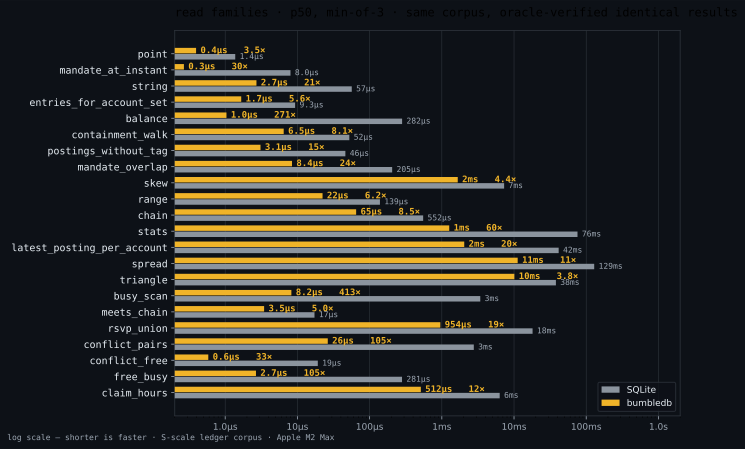
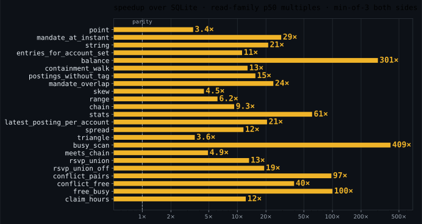
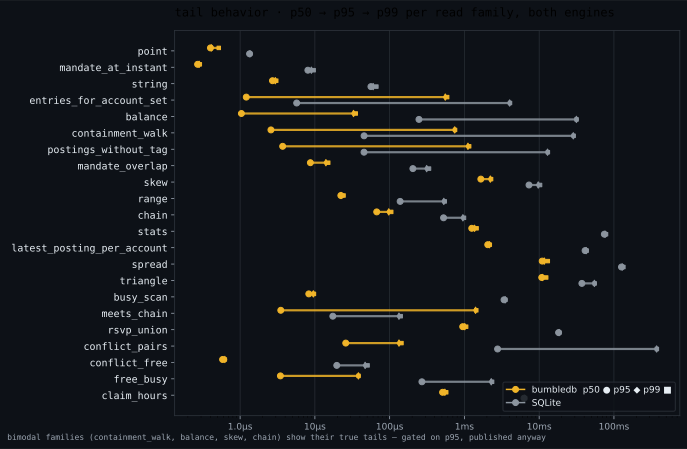
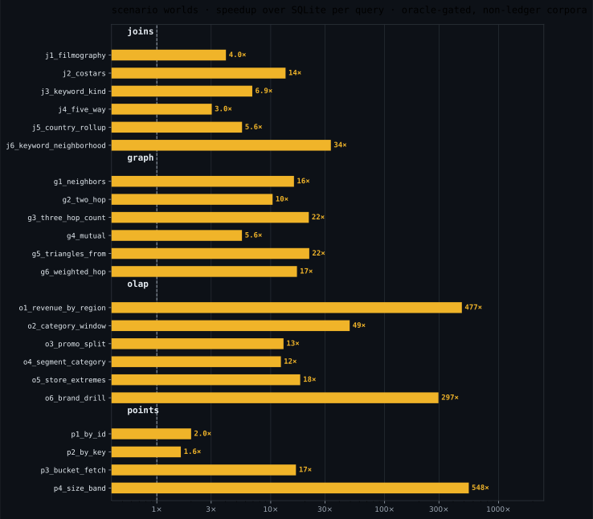
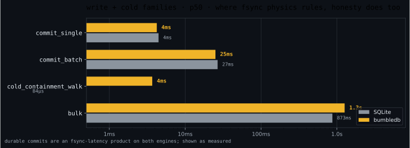

# bumbledb

An embedded, typed, **set-semantic** relational database for Rust, built on
LMDB, executing conjunctive queries with **Free Join** — and tuned, one
measured PRD at a time, for Apple Silicon.

There is no SQL and no interpreter in the hot path. You declare a schema with
a macro, write plain structs, and run queries — rule programs with joins,
negation, the full Allen interval algebra (one 13-bit mask, one branchless
kernel), point membership, `Duration`, and the coalescing `Pack` aggregate —
planned once and executed over columnar in-memory images with a lazy trie
join. Results are sets; a multi-rule query's union *is* the sink's dedup.
Invariants are dependency statements — functional and inclusion dependencies,
judged at commit against the final state — and read-compute-write is
optimistic, witnessed by snapshots, checked in one compare at commit.
Everything the engine claims about performance is a pinned, reproducible
measurement with two differential oracles standing behind it.

```rust
bumbledb::schema! {
    pub Ledger;

    // A vocabulary is a closed relation: rows are ground axioms, frozen
    // by the fingerprint, virtual in storage — the store holds zero
    // vocabulary bytes. The macro emits a host enum welded to the row ids.
    closed relation Region as RegionId = { Na, Eu, Apac, Latam };
    closed relation Status as StatusId = { Open, Frozen, Closed };

    relation Holder {
        id: u64 as HolderId, fresh,
        name: str,
        region: u64 as RegionId,
    }
    relation Account {
        id: u64 as AccountId, fresh,
        holder: u64 as HolderId,
        status: u64 as StatusId,
        opened_at: i64,
    }

    // Everything relational is a statement between the blocks — there are
    // no field-level modifiers. `fresh` auto-materializes R(id) -> R.
    Account(holder) <= Holder(id);   // containment: every account's holder exists
    Holder(region)  <= Region(id);   // a closed reference: an O(1) member-set test
    Account(status) <= Status(id);
}

let db = bumbledb::Db::create(path, Ledger)?;

// Writes are set arithmetic on an in-memory delta; every statement is
// judged at commit against the final state — an abort never touched disk.
db.write(|tx| {
    let holder: HolderId = tx.alloc()?;
    tx.insert(&Holder { id: holder, name: "alice", region: Region::Eu.id() })?;
    let account: AccountId = tx.alloc()?;
    tx.insert(&Account { id: account, holder, status: Status::Open.id(), opened_at: 17_000_000 })?;
    Ok(())
})?;

// Queries are rule programs in set-builder notation (the `query!` macro
// lowers to plain-data IR at compile time; the raw IR remains the contract).
// Prepared once, executed on snapshots into a reusable buffer — zero
// allocations per execution after warmup.
let q = bumbledb_query::query!(Ledger {
    (h, name) | Holder(id: h, name), Account(holder: h, status == Status::Open);
});
let mut prepared = db.prepare(&q)?;
db.read(|snap| {
    snap.execute(&mut prepared, &params, &mut results)?;
    Ok(())
})?;
```

Newtypes are the nominal-safety layer: `HolderId` and `AccountId` are
distinct host types, and mixing them is a **compile error** — the database's
type discipline is enforced by rustc, not by runtime checks.

## The numbers

Same corpus, same queries, results verified identical against SQLite — and
every write judged identically by an independent naive model — across a
2,822-case differential oracle before any timing is believed:



The same data as multiples — twenty-three read families across two theories:
the ledger (point lookups through negation, interval probes, and the triangle
join) and the calendar (Allen-mask scans, the RSVP-arm union, conflict pairs,
`Pack` free-busy, `Sum(Duration)` accounting):



Latency is a distribution, not a number. p50 → p95 → p99 per family, both
engines — the bimodal families show their true tails and still sit an order
of magnitude inside SQLite's:



Beyond the ledger, the suite runs four non-ledger scenario worlds —
JOB-shaped joins, a social graph, an OLAP star, and point-lookup surfaces —
22 queries, each oracle-gated before timing. Geomean across all 22: **16×**:



And the honest chart — durable writes are an fsync-latency product on both
engines, and bulk load favors SQLite's write path; we publish it anyway:



**Context that keeps these numbers honest:** S-scale corpora (a 10⁵-row-
fact-table ledger and a calendar world of interval claims, RSVP arms, and
ray horizons), Apple M2 Max, engine-favorable workload class (point lookups
through multi-way joins, interval algebra, and aggregates — exactly what a
set-semantic Free Join engine is built for). SQLite is measured warm,
prepared, and well-indexed on the identical data. One internal sub-
measurement is currently a recorded loss: the rule-disjointness elision
(`rsvp_union` vs `rsvp_union_off`) measures ~14% slower than the seen-set
it removes, pending the owner's ratchet ruling. This is a research engine
validated at this scale, not a production database. Regenerate everything
yourself:

```sh
cargo build --release -p bumbledb-bench
target/release/bumbledb-bench gen && target/release/bumbledb-bench verify
target/release/bumbledb-bench bench --out bench-out/run1   # ×3
target/release/bumbledb-bench scenarios --out bench-out/scen
python3 scripts/bench_viz.py bench-out/run1 bench-out/run2 bench-out/run3 \
        --scenarios bench-out/scen/scenarios.md
```

## Why it's fast

Three design decisions do most of the work; deliberate microarchitecture
does the rest.

1. **Representation over control flow.** Relations live as columnar images
   (decoded once per generation, cached); queries run over a lazy trie
   (COLT) that materializes exactly the levels a join actually probes.
   Nothing is interpreted per row.
2. **Batched, two-phase execution.** The executor probes in batches of ~128:
   phase one computes all hashes (pure ALU), phase two issues all bucket
   loads as independent chains that fill the M-series' ~28 outstanding-miss
   lanes. Misses become branchless survivor compaction, never per-tuple
   control flow.
3. **Set semantics end to end.** No duplicate bookkeeping, no ordering
   obligations, idempotent writes — the algebra removes work before the
   machine ever sees it.

Beneath all three sits the **staging law**: every computation runs at the
earliest stage where its inputs are fixed, across the seven-stage ladder —
expansion, open, prepare, bind, generation, execute, commit. Vocabularies
seal at schema validation, statements into closed relations compile to
in-register word-sets, closed-atom joins fold at prepare into plan-constant
handle sets — and folding produces **data, never code** (no JIT, ever). The
ladder is written down in [40 — Execution](docs/architecture/40-execution.md)
§ the staging law.

On top of that sit six microarchitectural mechanisms, each earning its
complexity with a measured, cited win at its site: bucket-of-8 tag-byte maps
at occupancy-invariant load factors, SWAR window probes, const-generic key
monomorphization, one software-prefetch pass, alias-hoisted loops, and a
single run-coherence memo. Nothing else made the cut — an optimization that
cannot cite its number does not ship.

## The theory grammar

A `schema!` block is a **presentation of a theory** in dependency theory's
own notation, ASCII-projected (the lexer bans `⊆`; nothing else changed).
The *signature* is the relation blocks — names and typed fields; the
*axioms* are the statements between them. Nothing inside the braces is
Rust: the macro is a compiler front-end that assigns these tokens the
calculus's semantics, and its grammar is open-ended and gate-governed — a
statement form enters when it carries an enforcement plan, never before.


### The signature — six types and the vocabulary form

| type | syntax | encoding (canonical; identity = bytes) | denotes | query operators |
|---|---|---|---|---|
| `u64` | `n: u64` | big-endian word, order-preserving | a natural | `==` `!=` `<` `<=` `>` `>=`, ∈-sets, `Sum/Min/Max/Count` |
| `i64` | `t: i64` | sign-flipped big-endian (memcmp order = numeric order) | an integer | same as `u64` |
| `bool` | `b: bool` | one byte, strictly 0/1 (anything else is corruption) | a truth value | `==` `!=`; Any/All are `Max`/`Min` |
| `str` | `s: str` | intern id — the dictionary maps repeated text to words; UTF-8 parsed at intern | text under reuse | `==` `!=`, ∈-sets; **order/prefix refused** |
| `bytes<N>` | `h: bytes<32>` | N raw bytes inline, word-padded; never interned | an identity (digest) | `==` `!=`, ∈-sets; **order refused** (a hash's order is an encoding artifact) |
| `interval<E>` | `d: interval<i64>` | two order-preserving words `(start, end)`, half-open `[s, e)`, `s < e`; `end = MAX` denotes the ray `[s, ∞)` | **the set of points** `{p : s ≤ p < e}` | `p ∈ d` (membership), `Allen(mask)` (all 8,192 pair relations), `Duration` (the measure), `Pack` (coalesce) |
| `closed relation` | `closed relation Status as StatusId = { Open, Frozen }` | virtual — rows are **ground axioms** sealed at validate, handle id = declaration order; the store holds zero vocabulary bytes | a vocabulary: the theory's named constants | referenced as a `u64` + containment to its key; handles resolve at expansion; `==` `!=`, ∈-sets; **order refused** |

`closed relation` is a relation form, not a seventh value type: its rows
live in the schema (frozen by the fingerprint, never written), the macro
emits a **host enum** welded to the row ids — an emission, not a type —
and a reference to it is an ordinary `u64` field under the handle newtype
plus a containment statement. Two tiers, one production — handles only,
or handles with **payload columns** stating what each word means, read by
ψ-selections in statements and queries alike:

```rust
closed relation Status as StatusId = { Open, Frozen, Closed };

closed relation Kind as KindId {
    mastered: bool,
    rank: u64,
} = {
    DirectPass { mastered: true,  rank: 30 },
    JudgedPass { mastered: true,  rank: 20 },
    Failed     { mastered: false, rank: 10 },
};

Attempt(kind) <= Kind(id);                        // membership: one compiled bit test
Certificate(kind) <= Kind(id | mastered == true); // sub-vocabulary: the answer set itself
```

The two byte-shaped types split by one law — **intern what repeats; inline
what identifies** — and share no other axis. The interval's preconditions
(nonempty, half-open) are not conventions: they are exactly what makes
Allen's thirteen basic relations jointly exhaustive and pairwise disjoint.
Idioms, not types: time is `i64` epoch-microseconds; money is `i64` minor
units under a host newtype; floats never persist.

**Field modifiers** (both are host/engine boundary markers, not relations):

- `as NewType` — "known to the host as": mints the nominal layer rustc
  polices (`HolderId` ≠ `AccountId` at compile time). The engine itself
  stays structural — a type is an encoding, and names live in the host.
- `fresh` — a *generation* attribute: the engine mints fresh existential
  witnesses (dependency theory's fresh values, the chase's own move), and
  the key theorem `R(f) -> R` materializes automatically — a generator
  whose outputs could collide would not be a generator, so the statement is
  a consequence, not a choice. `u64` only.

### The axioms — the statements

Three operators; each is the literature's own symbol under ASCII.

**`R(X) -> R` — the functional dependency** (Armstrong's arrow, verbatim).
πX is injective on R: no two facts agree on X. Read `->` as *determines*.
Only the key form exists, and the grammar enforces that representationally:
the right-hand side admits no projection, so the rejected non-key FD is
*unwritable*, not merely invalid. **Pointwise lifting:** when X ends in an
interval position, "agree on X" reads through the denotation — no two facts
share the scalar prefix *and any point* — so per-group interval
disjointness (SQL's exclusion constraint) is this statement on this type,
a theorem rather than a feature.

**`A(X | φ) <= B(Y | ψ)` — the (conditional) inclusion dependency**:
πX(σφ(A)) ⊆ πY(σψ(B)). Read `<=` as *is contained in* — it is `⊆` written
in the tokens Rust lexes, and the choice is principled: the subset order is
an order. The acceptance gate requires Y to be a key of B (one guard probe
answers "is this tuple present"). SQL's foreign key is the unselected
special case; the selected form is the CIND of the data-quality
literature. **Pointwise lifting:** an interval position turns containment
into *coverage* — every point of A's interval lies under B's segments,
checkable in O(log n + segments) because B's own key keeps its segments
disjoint and ordered.

**`A(..) == B(..)` — mutual inclusion**: both containments, each judged
independently. Read `==` as *exactly*. This is the discriminated-union
operator: `Parent(id | kind == V) == Arm(parent)` buys totality (a V-kinded
parent *has* its arm row, same commit), arm validity (an arm row's parent
exists *with that kind*), and exclusivity (an id in two arms would force
`kind` to equal two variants — a contradiction, not a rule).

**Selections `| f == v`** are σ with equality only — the same restriction
the CIND literature imposes — and a selected field may not also be
projected. `|` reads as *such that*, the set-builder bar. The two levels of
`==` (sets between atoms, values inside selections) are one concept —
equality of denotations — at two types, exactly as mathematics uses `=`.

**The judgment discipline**, which is what makes the notation load-bearing:
a statement is accepted only if the checker holds an
O(log n)-per-touched-fact enforcement plan (the acceptance gate), and every
statement is judged once per commit against the transaction's *final
state* — no modes, no deferral, no triggers. A committed database is a
model of its theory, always. Where SQL's constraint zoo went, word by word,
is recorded in [00 — Product](docs/architecture/00-product.md)'s deleted
vocabulary.

## Architecture

The design is documented before it is code, and the docs are normative:
when code and these docs disagree, one of them is wrong and the repo is
broken until they agree.

| doc | what it owns |
|---|---|
| [00 — Product](docs/architecture/00-product.md) | what bumbledb is and refuses to be; the deleted vocabulary; the unsafe policy |
| [10 — Data Model](docs/architecture/10-data-model.md) | the six structural types, the interval denotation, set semantics, identity |
| [20 — Query IR](docs/architecture/20-query-ir.md) | queries as data: atoms, negation, membership, param sets, aggregates |
| [30 — Dependencies](docs/architecture/30-dependencies.md) | the two judgments, statements, pointwise lifting, the acceptance gate |
| [40 — Execution](docs/architecture/40-execution.md) | Free Join, COLT, anti-probes, batching, the Apple Silicon model |
| [50 — Storage](docs/architecture/50-storage.md) | LMDB layout, guards as judgment accelerators, the delta write path |
| [60 — Validation](docs/architecture/60-validation.md) | the two oracles, the bench ledger, measurement discipline |
| [70 — Embedding API](docs/architecture/70-api.md) | the `schema!` grammar, `Db`, transactions, point reads, witnessed writes, prepared queries |

The intuition-transfer companion is [`docs/cookbook.md`](docs/cookbook.md) —
twenty-three worked schemas (unions, vocabularies, trees, calendars, tax
brackets, ledgers), each rot-proofed by a compile test, each comment naming
the theorem its statement buys.

The algorithmic reference is Wang, Willsey & Suciu, *Free Join: Unifying
Worst-Case Optimal and Traditional Joins* (arXiv:2301.10841), vendored in
[`docs/free-join-paper/`](docs/free-join-paper/).

## Measurement discipline

The part of this repo most worth stealing. Performance claims here are gated
by machinery, not judgment:

- **Two differential oracles before every timing run**: 2,822 cases —
  family queries and randomized queries against SQLite, plus a randomized
  write stream whose every commit verdict (accept or abort, and the
  violated statement) must match an independent brute-force naive model;
  the bench binary refuses to time against an unverified build (per-binary
  stamps).
- **A machine-wide measurement lock** (`scripts/measure.sh`) so two agents'
  runs never overlap, and **clock-proxy bracketing** around every timed block
  — blocks that ran during a DVFS sag or co-tenant interference are flagged
  and excluded, with optional per-sample normalization to adjudicate.
- **Disassembly gates** (`scripts/check-asm.sh`): properties like "the probe
  loop contains no calls and no `bcmp`" are asserted against `objdump`
  output — an `#[inline(always)]` that silently stopped working fails a
  gate, not a code review.
- **Microbench pins**: load-bearing mechanisms carry `#[ignore]`d in-tree
  benchmarks that re-assert their measured margins on demand.
- **Refutation is a result.** A mechanism that measures as a loss is
  reverted, and the record keeps the numbers and the failure mechanism —
  deletion is gated exactly like addition.

## Repository layout

```
crates/bumbledb/         the engine (LMDB via heed + blake3 are the only deps)
  src/exec/              executor, COLT, sinks, wordmap, NEON kernels
  src/storage/           LMDB env, deltas, commit, interning
  src/api/               Db, transactions, prepared queries
  src/plan/, src/ir/     planner and query IR
crates/bumbledb-macros/  the schema! proc macro (hand-rolled, no syn/quote)
crates/bumbledb-query/   the query! notation macro (downstream sugar; lowers to IR)
crates/bumbledb-bench/   the oracle + benchmark suite (gen/verify/bench/trace)
docs/                    the normative architecture + the cookbook (docs/cookbook.md)
scripts/                 measure.sh, check-asm.sh, check.sh, bench_viz.py
```

The gate suite (run `scripts/check.sh`, or by hand):

```sh
cargo fmt --all --check
cargo clippy --workspace --all-targets -- -D warnings
cargo test --workspace
cargo test --features alloc-counter --test alloc_gate --release
scripts/check-asm.sh          # machine-property gates (needs a release bench build)
```

## Status

Research-grade and honest about it: validated at S scale on one platform
(Apple Silicon; portable scalar fallbacks compile everywhere but carry no
performance promises). No network layer, no SQL, no in-place migrations —
by design. See [00 — Product](docs/architecture/00-product.md) for the full
list of things this database refuses to become.

## License

[0BSD](LICENSE) — use it for anything; no attribution required.
