# bumbledb

An embedded, typed, **set-semantic** relational database for Rust, built on
LMDB, executing conjunctive queries with **Free Join** — and tuned, one
measured PRD at a time, for Apple Silicon.

There is no SQL and no interpreter in the hot path. You declare a schema with
a macro, write plain structs, and run queries — rule programs with joins,
negation, the full Allen interval algebra (one 13-bit mask, one branchless
kernel), point membership, `Duration`, and the coalescing `Pack` aggregate —
planned once and executed over columnar in-memory images with a lazy trie
join. Answers are sets; a multi-rule query's union *is* the sink's dedup.
Invariants are dependency statements — functional and inclusion dependencies,
judged at commit against the final state — and read-compute-write is
optimistic, witnessed by snapshots, checked in one compare at commit.
Everything the engine claims about performance is a pinned, reproducible
measurement with two differential oracles standing behind it.

```rust
bumbledb::schema! {
    pub Ledger;

    // A vocabulary is a closed relation: its ground axioms are frozen
    // by the fingerprint, virtual in storage — the store holds zero
    // vocabulary bytes. The macro emits a host enum welded to declaration ids.
    closed relation Region as RegionId = { Na, Eu, Apac, Latam };
    closed relation Status as StatusId = { Open, Frozen, Closed };

    relation Holder {
        id: u64 as HolderId, fresh,
        name: str,
        region: u64 as RegionId,
    }
    relation Account {
        id: u64 as AccountId, fresh,
        holder: u64 as HolderId,
        status: u64 as StatusId,
        opened_at: i64,
    }

    // Everything relational is a statement between the blocks — there are
    // no field-level modifiers. `fresh` auto-materializes R(id) -> R.
    Account(holder) <= Holder(id);   // containment: every account's holder exists
    Holder(region)  <= Region(id);   // a closed reference: an O(1) member-set test
    Account(status) <= Status(id);
}

let db = bumbledb::Db::create(path, Ledger)?;

// Writes are set arithmetic on an in-memory delta; every statement is
// judged at commit against the final state — an abort never touched disk.
db.write(|tx| {
    let holder: HolderId = tx.alloc()?;
    tx.insert(&Holder { id: holder, name: "alice", region: Region::Eu.id() })?;
    let account: AccountId = tx.alloc()?;
    tx.insert(&Account { id: account, holder, status: Status::Open.id(), opened_at: 17_000_000 })?;
    Ok(())
})?;

// Queries are rule programs in set-builder notation (the `query!` macro
// lowers to plain-data IR at compile time; the raw IR remains the contract).
// Prepared once, executed on snapshots into reusable `Answers` — zero
// allocations per execution after warmup.
let q = bumbledb_query::query!(Ledger {
    (h, name) | Holder(id: h, name), Account(holder: h, status == Status::Open);
});
let mut prepared = db.prepare(&q)?;
db.read(|snap| {
    snap.execute(&mut prepared, &params, &mut results)?;
    Ok(())
})?;
```

Newtypes are the nominal-safety layer: `HolderId` and `AccountId` are
distinct host types, and mixing them is a **compile error** — the database's
type discipline is enforced by rustc, not by runtime checks.

## The numbers

**The protocol note, once, for every number and chart below.** Everything
derives from one committed artifact set: the 2026-07-20 bench night
(`bench-out/night-2026-07-20/`, engine rev `ec0b9c75`, Apple M2 Max,
S-scale corpora). It was a **shared-machine night** under the recorded
ruling: the process ran at boosted (user-interactive) QoS while the owner's
background agents ran on the same box — every report stamps
`shared_machine: true` plus the load averages, and the honesty floor is
interleaved A/B sampling with contamination excluded-and-counted. One
durable run (r2) WAS contaminated (agent load hit its write families
mid-run; the report records the night's only `LOSS` verdict); it stays
committed with its `CONTAMINATED.md` marker and is excluded from every
number here — merged pools are min-over-clean (durable r1+r3, all three
ephemeral runs). Every query is oracle-gated before it is ever timed:
value-identical multisets against SQLite (2,876 differential cases for the
suite; per-draw gates in the lanes), and every write verdict matches an
independent naive model. SQLite is measured warm, prepared, and
well-indexed on identical data, under the parity configs in
[61 — Bench lanes](docs/architecture/61-bench-lanes.md). This is an
engine-favorable workload class (joins, interval algebra, aggregates) at
research scale — and the charts below include every regime we lose.

### Reads: every family in the pin

Same corpus, same queries, results verified identical before timing. All
**32** read families — the 22 gated ledger+calendar families and the 10
report-class families (slots, closures, the displaced-window set) — nothing
filtered:


The same data as multipliers. Geomean over the 22 gated families:
**19.3×** SQLite p50 (durable store, min-over-clean); the ephemeral runs
land at **21.3×** (min-of-3) — reads are mmap-warm either way. Across all
32 families the durable geomean is **21.8×**. The spread is honest: `point`
lookups are only **2.8×** (a B-tree is good at this), `triangle` **3.8×**,
while `balance` is **263×**, `busy_scan` **471×**, and the displaced-stream
family ~**295×**:


Latency is a distribution, not a number — p50 → p95 → p99 per family, both
engines. The bimodal families (`containment_walk`, `balance`, `skew`,
`chain`) show their true tails. The night's suite reports carry
`budget_ok: false`, published as such: `spread` and `triangle` (and the
report-class `disp_probe` trio) land p99 outside their per-family budget
gates on this shared-machine night — the p50 wins are real, those tails did
not clear the bar, and both facts are on the chart:


The same tails as a p50 → p90 → p99 fan:

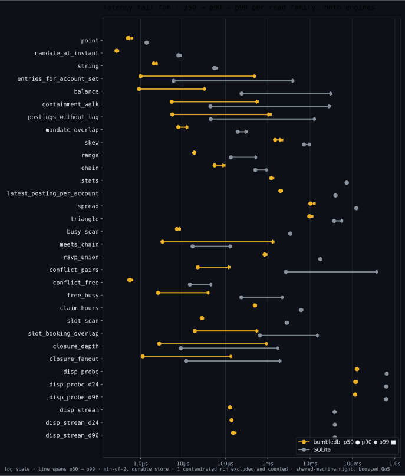

And the composite honesty chart — every read family and every scenario
(query, lane) as one sorted ratio bar; anything below parity draws red, and
a DNF lane joins no bar (excluded and counted in the title):

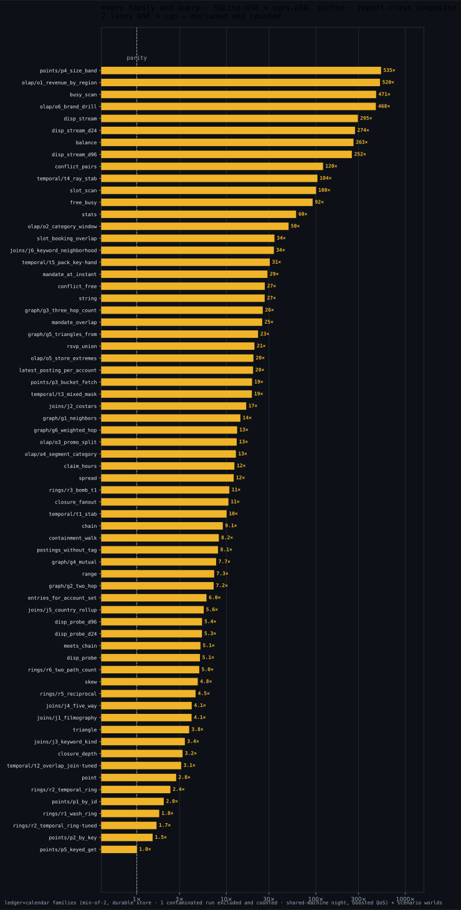

### The scenario worlds

Six non-ledger worlds — joins, graph, olap, points, rings, temporal — 36
(query, SQLite-lane) pairs, each oracle-gated before timing. Geomean across
the **34 timed lanes: 12.0×**; the 2 lanes where SQLite exceeded the
per-sample cap are excluded from that geomean and counted (they get their
own chart below):


Per world, paired p50 bars (SQLite grey, ours amber):

`joins` — the IMDB-shaped join battery, two- through five-way:

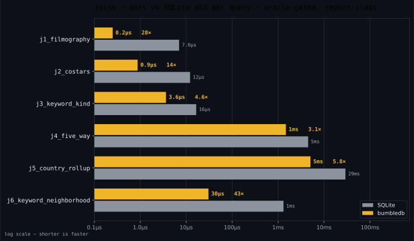

`graph` — neighborhoods, two-hop, mutual edges, triangles:

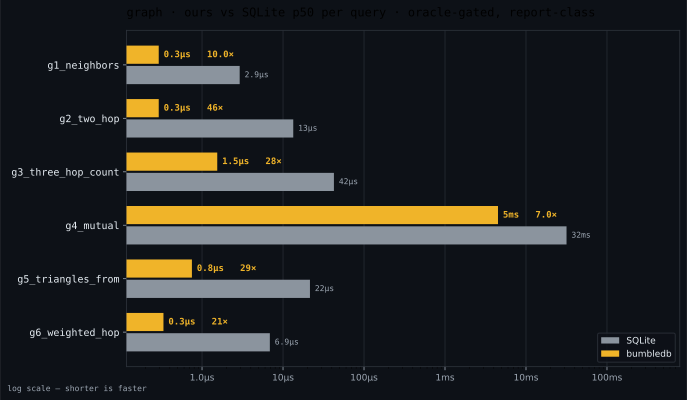

`olap` — group-by rollups, windows, drill-downs:

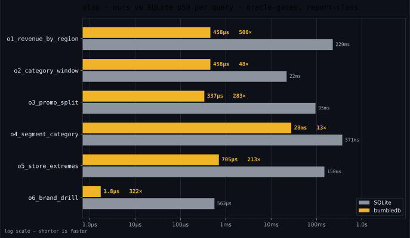

`points` — deliberate home turf for SQLite: point reads by id and key,
bucket fetches, and 0.5.0's keyed GET (`p5_keyed_get` — the typed point
read through the declared key FD, full fact decoded, no query machinery).
This is the closest world on the board: `p2_by_key` **1.50×**, and p5 is a
dead heat at **1.00×** against SQLite's prepared point SELECT through the
unique index — a B-tree point lookup is the thing SQLite is best at, and
we publish the world at full prominence:

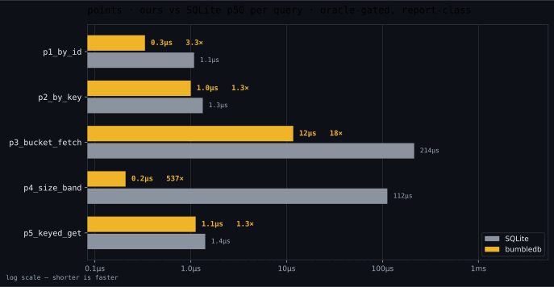

`rings` — cyclic joins, where the binary-join exponent lives; `r1_wash_ring`
at **1.8×** is among our narrowest wins, `r3_bomb_t1` (the tier-1 bipartite
bomb) is **10.8×**, and tier 2 is a DNF (below):

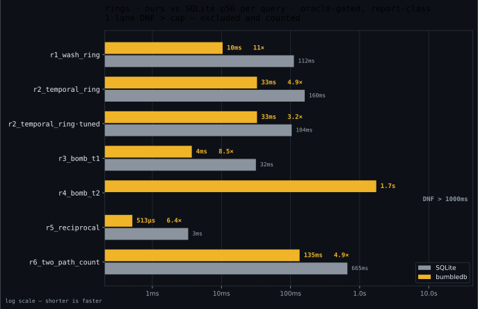

`temporal` — the Allen kernel: stabbing, overlap twins, rays, `Pack`. The
hand-tuned SQLite twins are reported beside the canonical translation
(`·tuned` rows) — we never flatter ourselves in either direction:

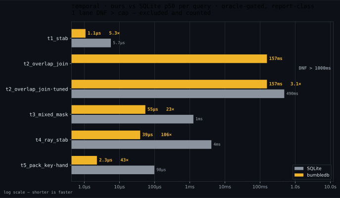

### The adversarial story: DNF > cap

Adversarial SQLite lanes run under a 1000 ms per-sample wall-clock cap. A
capped lane has no number — it is drawn as the cap (hatched), never as a
measurement, and never enters a ratio. The night's two DNFs: `r4_bomb_t2`
(the tier-2 bipartite bomb — ours answers in **1.58 s**, SQLite's canonical
plan exceeds the cap) and `t2_overlap_join` (the temporal overlap join —
ours **163 ms**, canonical SQLite DNF > cap; the hand-tuned SQLite twin
does finish and loses at 3.1×, on the temporal chart above — the canonical
DNF is the binary-join exponent showing up as wall-clock, excluded and
counted):

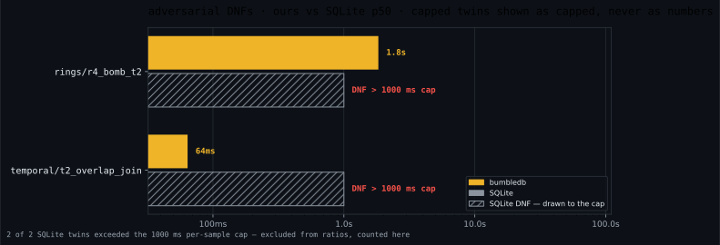

### The home-turf worlds: crud and lawful — where SQLite wins

Two worlds built deliberately on the opponent's turf, the regimes where
SQLite is expected to be strong — measured this night and published as the
losses they are. Both are report-class (no gate reads a number), run as
durability-paired twins (durable and NOSYNC) folding one shared op stream
per family, with post-state value-verification on every relation.

`crud` — OLTP round-trips: point reads, single/batched inserts, keyed
updates, upserts, read-modify-write, deletes, a 90/10 mix. SQLite wins
**20 of 22 rows**; the world's geomean is **0.51×** (durable lane 0.82×,
NOSYNC 0.32×). The keyed point read is ours (**2.3× durable, 2.4×
NOSYNC**) — every write family is SQLite's: near parity where fsync
physics dominates (durable single-row families land 0.81–0.91×) and
decisively where it doesn't — batched inserts fall to **0.22× durable /
0.12× NOSYNC** at 1000 rows per commit, and NOSYNC keyed writes sit at
0.21–0.44×. A B-tree with a page cache is very good at this workload, and
the chart says so in red:

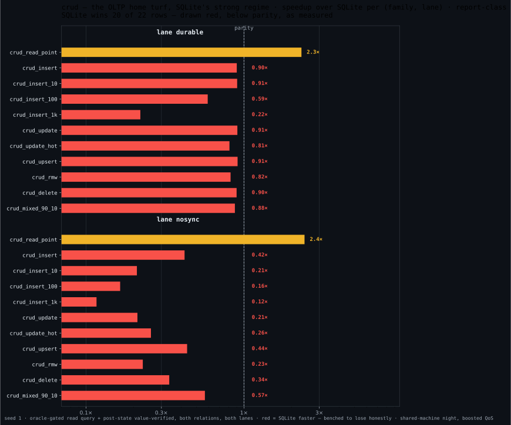

`lawful` — the integrity turf: a primer-shaped schema (identity keys,
relation containments, a ψ-selected containment, closed vocabularies, an
attempt-count window) with the full law roster judged on every commit,
against SQLite carrying equivalent UNIQUE / FK / CHECK / trigger
enforcement. Geomean **0.32×**, SQLite winning **10 of 12 rows**. Judged
admission itself is competitive — we win `law_commit_attempt` durable
(**1.2×**) and `law_commit_cluster` NOSYNC (**1.1×**) — but every refusal
row is SQLite's: a constraint failure refuses in single-digit µs while our
rejection prices the full dependency judgment plus the decoded violation
set (0.21–0.58×). The floor row is `law_reject_key` durable at **0.002×**
(4.4 ms vs 7.7 µs): each sample's sacrificial id advances the fresh
high-water mark, and the never-reissue law flushes the burned mark durably
even on an abort — that refusal pays an fsync by design, and the price is
printed rather than excused:

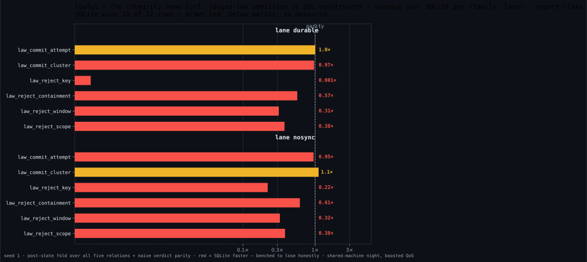

### Writes: fsync physics, published anyway

Durable commits are an fsync-latency product on both engines — the durable
suite families land at parity-shaped numbers (`commit_single` p50 4.5 ms
ours vs 5.1 ms SQLite, min-over-clean) — and **bulk load favors SQLite's
write path** (durable `bulk`: 1.25 s ours vs 0.93 s SQLite; we lose ~1.35×
and publish it):


The writes lane prices the whole ladder — commits and deletes at batch
1/10/100/1000 plus bulk append, per durability lane, post-state
value-verified. SQLite wins single-fact NOSYNC commits (24.7k vs 18.1k
rows/s) and bulk append in both lanes (468k vs 253k rows/s NOSYNC); we win
the batched middle (109k vs 87k rows/s at `commit_b1000` NOSYNC):

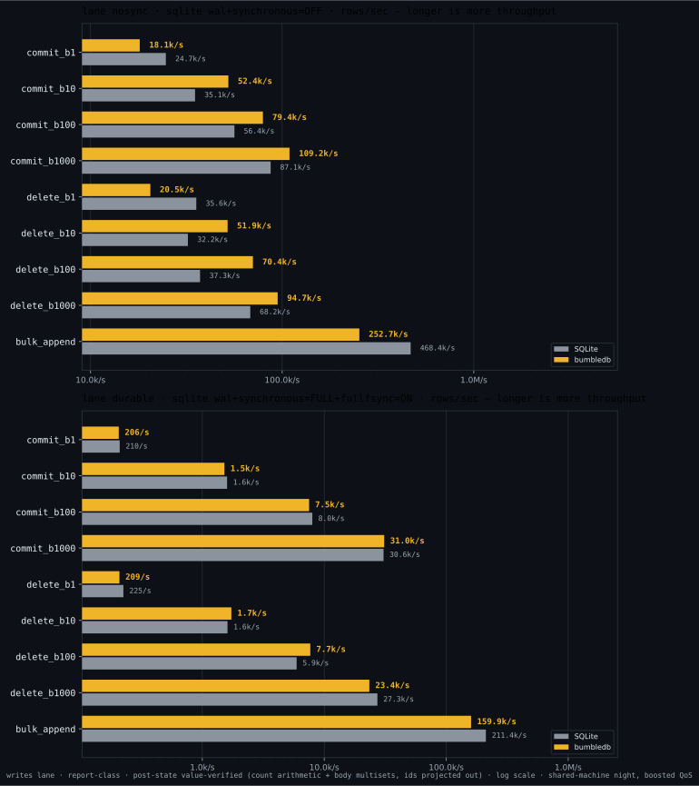

The same ladders as throughput curves — facts/sec against commit batch
size, per durability lane:

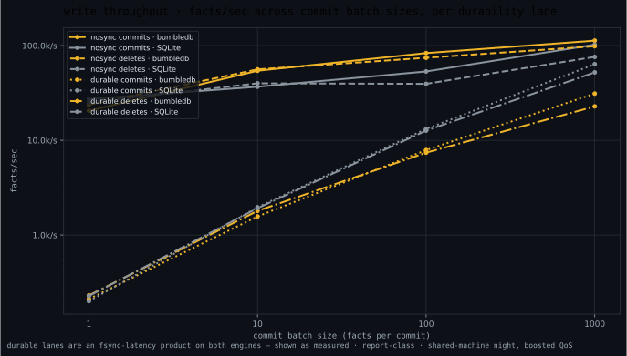

### Storage: we spend bytes, and the chart says so

bumbledb stores ~**308 B/fact** on the ledger and ~**392 B/fact** on the
calendar (compacted, S scale) against SQLite's **73/93 B/fact** indexed and
**20/24 B/fact** table-only — roughly **4× SQLite's indexed footprint**.
That is the price of the determinant indexes and the columnar layout the
read numbers ride on; every byte is behind a row-count cross-check:

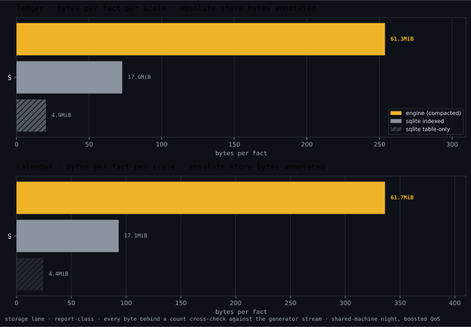

### Scale curves and warmth

The curves lane re-times four families at the pinned scale under per-draw
oracle gates (this night pinned one scale point per family, so the chart
shows gated points, not fitted exponents): `busy_scan` at S scale is
**477×** against canonical SQL and still **168×** against the hand-tuned
twin; `closure_fanout` is **30×**:

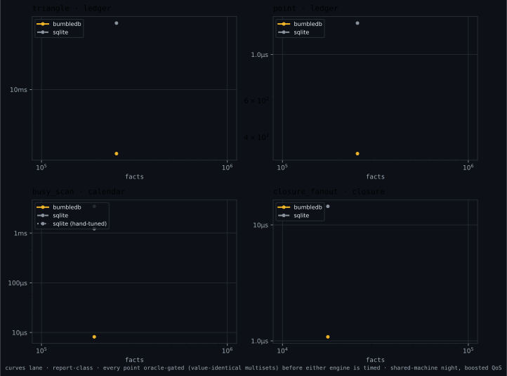

Warmth is where honesty gets granular: cold (process-fresh reopen, OS-warm
— the honesty bound stated in the report), warm, then memoized. The memo
effect is explicit rather than a hidden flatterer — and cold starts are a
regime we can lose: `closure_fanout` cold is **379 µs ours vs 16 µs
SQLite** (we win it warm, 1.0 µs vs 9.4 µs):

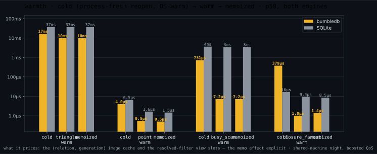

### Churn: what a long-lived life does to both engines

The churn lane runs 10,000 delete+insert cycles against a 100k-fact working
set, three runs (steady 64/32 churn/update mix, the same mix NOSYNC, and
delete-heavy 512/0), with every lane drawn — including `sqlite-maint`, the
operator who runs periodic VACUUM+ANALYZE with the wall time charged into
its own throughput window (marked ▼ from the recorded data). The
degradation story over 10k cycles, per the pinned series: SQLite's window
probe drifts 277 → 561 µs bare (and 277 → 791 µs on the maint lane) while
ours holds 19 → 21.5 µs; our store stays byte-flat (95.9 → 96.9 MB —
roughly 5.6× SQLite's on-disk size, consistent with the storage chart)
while SQLite's grows 14.8 → 17.3 MB bare and VACUUM claws it back;
write throughput: SQLite bare slides 55.6 → 47.5 commits/s vs ours
44.4 → 43.1 (SQLite ahead throughout on the durable steady run — shown),
and NOSYNC ours 309 → 257 vs SQLite 253 → 221.

Probe latency, every lane, per run:

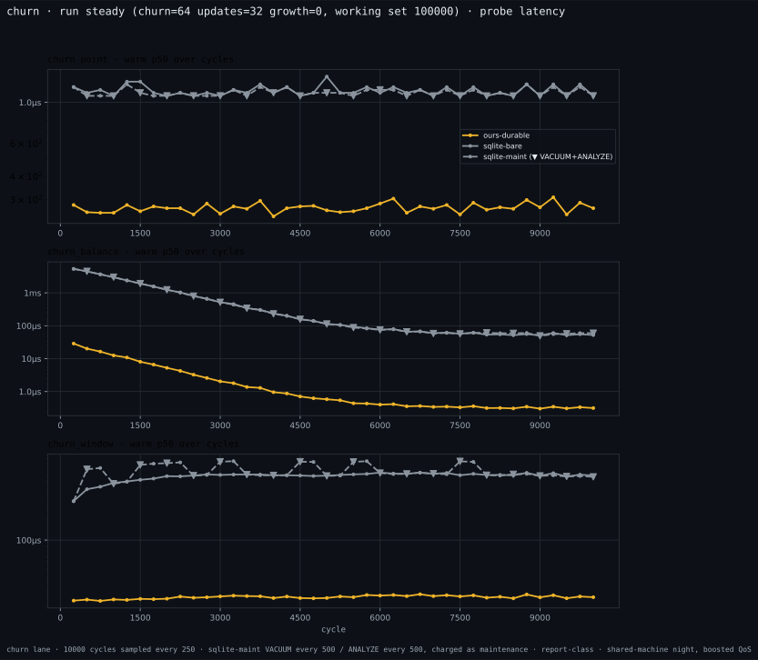
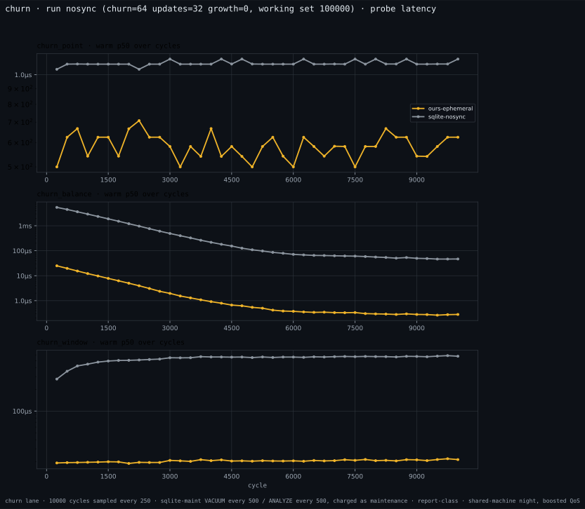
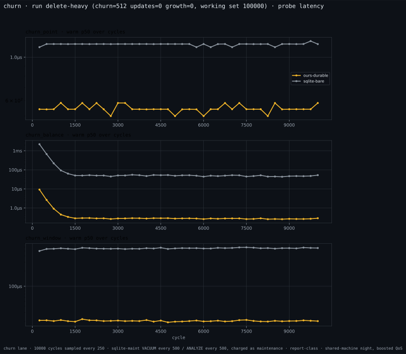

Store size over cycles (the VACUUM sawtooth is visible on the maint lane):

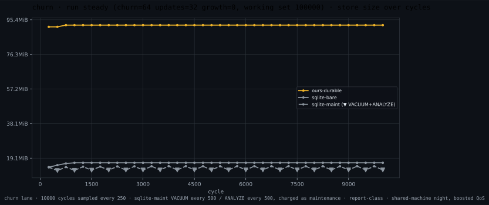
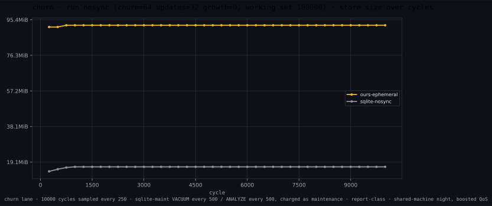
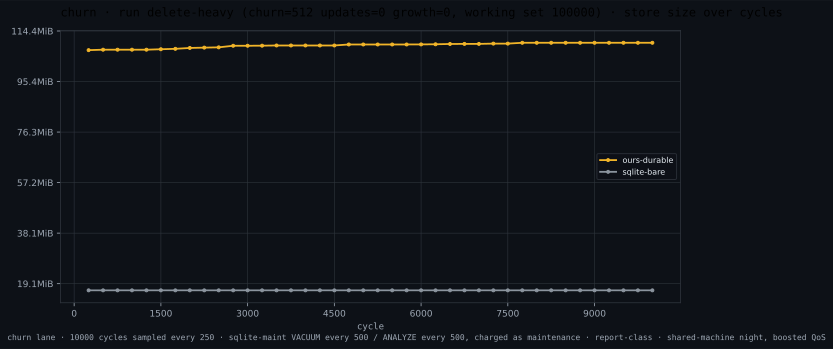

Write throughput over cycles:

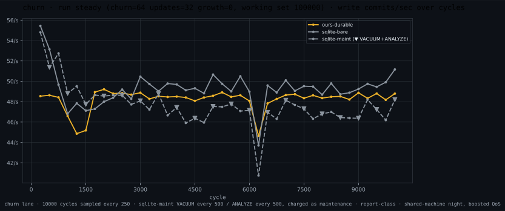
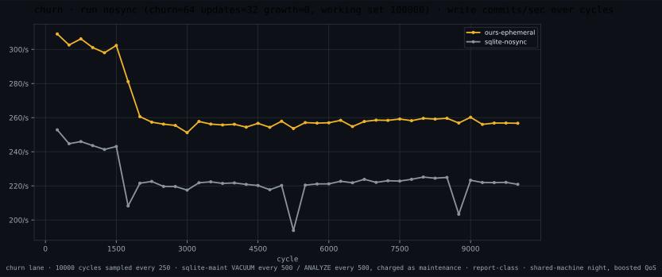
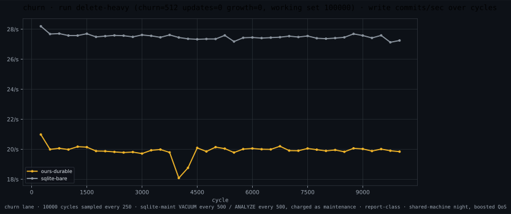

### Regenerate everything yourself

One internal experiment is a recorded refutation: replacing the multi-rule
spanning seen-set with per-rule drains measured ~32% slower, so that
optimization was removed and the proof remains diagnostic only. This is a
research engine validated at this scale, not a production database.

```sh
scripts/bench-night.sh bench-out/night-$(date +%F)   # the whole night, one command
# (--shared for a loaded machine — provenance stamps it; --plan to preview)

# or lane by lane:
cargo build --release -p bumbledb-bench
target/release/bumbledb-bench gen && target/release/bumbledb-bench verify
target/release/bumbledb-bench bench --out out/r1                # ×3, + --ephemeral ×3
target/release/bumbledb-bench scenarios --out out/scenarios
target/release/bumbledb-bench storage --out out/storage
target/release/bumbledb-bench writes --out out/writes
target/release/bumbledb-bench crud --out out/crud
target/release/bumbledb-bench lawful --out out/lawful
target/release/bumbledb-bench curves --warmth --out out/curves
target/release/bumbledb-bench churn --out out/churn

# every chart, from the pinned night (discovery finds every lane report;
# a run dir carrying CONTAMINATED.md is excluded and counted):
python3 scripts/bench_viz.py --night bench-out/night-2026-07-20 --out assets
```

The full Report-class lane registry, parity configs, the DNF-cap law, the
shared-machine ruling, and the night runbook:
[docs/architecture/61-bench-lanes.md](docs/architecture/61-bench-lanes.md).

## Why it's fast

Three design decisions do most of the work; deliberate microarchitecture
does the rest.

1. **Representation over control flow.** Relations live as columnar images
   (decoded once per generation, cached); queries run over a lazy trie
   (COLT) that materializes exactly the levels a join actually probes.
   Nothing is interpreted per row.
2. **Batched, two-phase execution.** The executor probes in batches of ~128:
   phase one computes all hashes (pure ALU), phase two issues all bucket
   loads as independent chains that fill the M-series' ~28 outstanding-miss
   lanes. Misses become branchless survivor compaction, never per-tuple
   control flow.
3. **Set semantics end to end.** No duplicate bookkeeping, no ordering
   obligations, idempotent writes — the algebra removes work before the
   machine ever sees it.

Beneath all three sits the **staging law**: every computation runs at the
earliest stage where its inputs are fixed, across the seven-stage ladder —
expansion, open, prepare, bind, generation, execute, commit. Vocabularies
seal at schema validation, statements into closed relations compile to
in-register word-sets, closed-atom joins fold at prepare into plan-constant
handle sets — and folding produces **data, never code** (no JIT, ever). The
ladder is written down in [40 — Execution](docs/architecture/40-execution.md)
§ the staging law.

On top of that sit six microarchitectural mechanisms, each earning its
complexity with a measured, cited win at its site: bucket-of-8 tag-byte maps
at occupancy-invariant load factors, SWAR window probes, const-generic key
monomorphization, one software-prefetch pass, alias-hoisted loops, and a
single run-coherence memo. Nothing else made the cut — an optimization that
cannot cite its number does not ship.

## The theory grammar

A `schema!` block is a **presentation of a theory** in dependency theory's
own notation, ASCII-projected (the lexer bans `⊆`; nothing else changed).
The *signature* is the relation blocks — names and typed fields; the
*axioms* are the statements between them. Nothing inside the braces is
Rust: the macro is a compiler front-end that assigns these tokens the
calculus's semantics, and its grammar is open-ended and gate-governed — a
statement form enters when it carries an enforcement plan, never before.


### The signature — six types and the vocabulary form

| type | syntax | encoding (canonical; identity = bytes) | denotes | query operators |
|---|---|---|---|---|
| `u64` | `n: u64` | big-endian word, order-preserving | a natural | `==` `!=` `<` `<=` `>` `>=`, ∈-sets, `Sum/Min/Max/Count` |
| `i64` | `t: i64` | sign-flipped big-endian (memcmp order = numeric order) | an integer | same as `u64` |
| `bool` | `b: bool` | one byte, strictly 0/1 (anything else is corruption) | a truth value | `==` `!=`; Any/All are `Max`/`Min` |
| `str` | `s: str` | intern id — the dictionary maps repeated text to words; UTF-8 parsed at intern | text under reuse | `==` `!=`, ∈-sets; **order/prefix refused** |
| `bytes<N>` | `h: bytes<32>` | N raw bytes inline, word-padded; never interned | an identity (digest) | `==` `!=`, ∈-sets; **order refused** (a hash's order is an encoding artifact) |
| `interval<E>` | `d: interval<i64>` | two order-preserving words `(start, end)`, half-open `[s, e)`, `s < e`; `end = MAX` denotes the ray `[s, ∞)` | **the set of points** `{p : s ≤ p < e}` | `p ∈ d` (membership), `Allen(mask)` (all 8,192 pair relations), `Duration` (the measure), `Pack` (coalesce) |
| `closed relation` | `closed relation Status as StatusId = { Open, Frozen }` | virtual — **ground axioms** sealed at validate, handle id = declaration order; the store holds zero vocabulary bytes | a vocabulary: the theory's named constants | referenced as a `u64` + containment to its key; handles resolve at expansion; `==` `!=`, ∈-sets; **order refused** |

`closed relation` is a relation form, not a seventh value type: its ground axioms
live in the schema (frozen by the fingerprint, never written), the macro
emits a **host enum** welded to declaration ids — an emission, not a type —
and a reference to it is an ordinary `u64` field under the handle newtype
plus a containment statement. Two tiers, one production — handles only,
or handles with **payload columns** stating what each word means, read by
ψ-selections in statements and queries alike:

```rust
closed relation Status as StatusId = { Open, Frozen, Closed };

closed relation Kind as KindId {
    mastered: bool,
    rank: u64,
} = {
    DirectPass { mastered: true,  rank: 30 },
    JudgedPass { mastered: true,  rank: 20 },
    Failed     { mastered: false, rank: 10 },
};

Attempt(kind) <= Kind(id);                        // membership: one compiled bit test
Certificate(kind) <= Kind(id | mastered == true); // sub-vocabulary: the answer set itself
```

The two byte-shaped types split by one law — **intern what repeats; inline
what identifies** — and share no other axis. The interval's preconditions
(nonempty, half-open) are not conventions: they are exactly what makes
Allen's thirteen basic relations jointly exhaustive and pairwise disjoint.
Idioms, not types: time is `i64` epoch-microseconds; money is `i64` minor
units under a host newtype; floats never persist.

**Field modifiers** (both are host/engine boundary markers, not relations):

- `as NewType` — "known to the host as": mints the nominal layer rustc
  polices (`HolderId` ≠ `AccountId` at compile time). The engine itself
  stays structural — a type is an encoding, and names live in the host.
- `fresh` — a *generation* attribute: the engine mints fresh existential
  witnesses (dependency theory's fresh-existential repair move), and
  the key theorem `R(f) -> R` materializes automatically — a generator
  whose outputs could collide would not be a generator, so the statement is
  a consequence, not a choice. `u64` only.

### The axioms — the statements

Three operators; each is the literature's own symbol under ASCII.

**`R(X) -> R` — the functional dependency** (Armstrong's arrow, verbatim).
πX is injective on R: no two facts agree on X. Read `->` as *determines*.
Only the key form exists, and the grammar enforces that representationally:
the right-hand side admits no projection, so the rejected non-key FD is
*unwritable*, not merely invalid. **Pointwise lifting:** when X ends in an
interval position, "agree on X" reads through the denotation — no two facts
share the scalar prefix *and any point* — so per-group interval
disjointness (SQL's exclusion constraint) is this statement on this type,
a theorem rather than a feature.

**`A(X | φ) <= B(Y | ψ)` — the (conditional) inclusion dependency**:
πX(σφ(A)) ⊆ πY(σψ(B)). Read `<=` as *is contained in* — it is `⊆` written
in the tokens Rust lexes, and the choice is principled: the subset order is
an order. The acceptance gate requires Y to be a key of B (one key probe
answers "is this tuple present"). SQL's referential constraint is the unselected
special case; the selected form is the CIND of the data-quality
literature. **Pointwise lifting:** an interval position turns containment
into *coverage* — every point of A's interval lies under B's segments,
checkable in O(log n + segments) because B's own key keeps its segments
disjoint and ordered.

**`A(..) == B(..)` — mutual inclusion**: both containments, each judged
independently. Read `==` as *exactly*. Because each direction's target must
be a declared key, accepted `==` is a key-backed one-to-one correspondence
on the selected projections: every selected A-fact has exactly one selected
B-witness with the same projected value, and vice versa. It is not literal
whole-fact equality (unprojected payloads may differ) and says nothing about
unselected facts — which is the discriminated-union idiom's whole point.
`Parent(id | kind == V) == Arm(parent)` buys totality (a V-kinded parent
*has* its arm fact, same commit), arm validity (an arm fact's parent exists
*with that kind*), and exclusivity (an id in two arms would force `kind` to
equal two variants — a contradiction, not a rule).

**Selections `| f == v`** are σ with equality only — the same restriction
the CIND literature imposes — and a selected field may not also be
projected. `|` reads as *such that*, the set-builder bar. The three equality
levels are one concept—equality of denotations—at three
different types: dependency `==` relates key-backed selected views, selection `==`
tests values inside σ, and query comparison `Eq` tests typed terms. They are never
interchangeable in diagnostics (`20-query-ir.md` § atom matching).

**The judgment discipline**, which is what makes the notation load-bearing:
a statement is accepted only if the checker holds an
O(log n)-per-touched-fact enforcement plan (the acceptance gate), and every
statement is judged once per commit against the transaction's *final
state* — no modes, no deferral, no triggers. A committed database is a
model of its theory, always. Where SQL's constraint zoo went, word by word,
is recorded in [00 — Product](docs/architecture/00-product.md)'s deleted
vocabulary.

## Architecture

The design is documented before it is code, and the docs are normative:
when code and these docs disagree, one of them is wrong and the repo is
broken until they agree.

| doc | what it owns |
|---|---|
| [00 — Product](docs/architecture/00-product.md) | what bumbledb is and refuses to be; the deleted vocabulary; the unsafe policy |
| [10 — Data Model](docs/architecture/10-data-model.md) | the six structural types, the interval denotation, set semantics, identity |
| [20 — Query IR](docs/architecture/20-query-ir.md) | queries as data: atoms, negation, membership, param sets, aggregates |
| [30 — Dependencies](docs/architecture/30-dependencies.md) | the two judgments, statements, pointwise lifting, the acceptance gate |
| [40 — Execution](docs/architecture/40-execution.md) | Free Join, COLT, anti-probes, batching, the Apple Silicon model |
| [50 — Storage](docs/architecture/50-storage.md) | LMDB layout, determinants as judgment accelerators, the delta write path |
| [60 — Validation](docs/architecture/60-validation.md) | the two oracles, the bench ledger, measurement discipline |
| [70 — Embedding API](docs/architecture/70-api.md) | the `schema!` grammar, `Db`, transactions, point reads, witnessed writes, prepared queries |

The intuition-transfer companion is [`docs/cookbook.md`](docs/cookbook.md) —
thirty worked schemas (unions, vocabularies, trees, calendars, tax
brackets, ledgers, maintained derived facts, host-driven closures, keyed
reads), each rot-proofed by a compile test, each comment naming the theorem
its statement buys.

The algorithmic reference is Wang, Willsey & Suciu, *Free Join: Unifying
Worst-Case Optimal and Traditional Joins* (arXiv:2301.10841), vendored in
[`docs/free-join-paper/`](docs/free-join-paper/).

The engine has a second host: [`ts/`](ts/README.md) is the TypeScript SDK,
`@bjornpagen/bumbledb` on npm. It is not a port and not a wire protocol —
schemas and queries declared in TypeScript lower through the same shared
schema library (`crates/bumbledb-theory`) into the same engine, in-process
over a napi bridge (`ts/crate`), so both hosts produce the same lowered
descriptors and the same query IR. The flavor is the host's; the meaning is
the theory's.

The semantics themselves have one normative home: [`lean/`](lean/README.md),
the Lean specification — the architecture docs motivate and cite it, never
restate it. The tree builds under a zero-sorry law (the proof-escape battery
in `scripts/lean.sh`), and the checked-in conformance corpus is judged three
ways — the real engine, the naive brute-force model, and the executable Lean
denotation — with any disagreement a failed gate.

## Measurement discipline

The part of this repo most worth stealing. Performance claims here are gated
by machinery, not judgment:

- **Two differential oracles before every timing run**: 2,876 cases —
  family queries and randomized queries against SQLite, plus a randomized
  write stream whose every commit verdict (accept or abort, and the
  violated statement) must match an independent brute-force naive model;
  the bench binary refuses to time against an unverified build (per-binary
  stamps).
- **A machine-wide measurement lock** (`scripts/measure.sh`) so two agents'
  runs never overlap, and **clock-proxy bracketing** around every timed block
  — blocks that ran during a DVFS sag or co-tenant interference are flagged
  and excluded, with optional per-sample normalization to adjudicate.
- **Disassembly gates** (`scripts/check-asm.sh`): properties like "the probe
  loop contains no calls and no `bcmp`" are asserted against `objdump`
  output — an `#[inline(always)]` that silently stopped working fails a
  gate, not a code review.
- **Checked lint exceptions**: suppressions are `#[expect]` claims with a
  reason, so an exception that stops being necessary fails the gate itself.
- **One pinned toolchain**: `rust-toolchain.toml` names one dated nightly
  (edition 2024, every gate on the same compiler); the pin
  moves deliberately — a PRD-sized action carrying the microbench re-earn
  session — never implicitly.
- **Microbench pins**: load-bearing mechanisms carry `#[ignore]`d in-tree
  benchmarks that re-assert their measured margins on demand.
- **Deletion is gated exactly like addition.** The fuzzing apparatus is the
  worked example: after thousands of executions its trophy ledger held zero
  engine bugs (the Lean spec, the conformance corpus, and the two-oracle
  differentials were already holding the same seams), so it was hard-deleted
  by owner ruling rather than kept as ceremony —
  `docs/architecture/60-validation.md` § the deletion record.
- **Two home-turf worlds bench the regimes where SQLite is expected to
  win.** `crud` (OLTP round-trips under matched durability pairs) and
  `lawful` (judged-law admission and refusal pricing against SQLite
  FK/UNIQUE/CHECK/trigger enforcement) ship as report-class subcommands,
  oracle-gated and post-state-verified, deliberately built on the
  opponent's turf — `docs/architecture/60-validation.md` § the home-turf
  worlds. Their numbers landed with the 2026-07-20 night and are published
  above as the losses they are (crud geomean 0.51×, lawful 0.32× — the
  home-turf section).
- **Refutation is a result.** A mechanism that measures as a loss is
  reverted, and the record keeps the numbers and the failure mechanism.

## Repository layout

```
crates/bumbledb/         the engine — external deps: heed (LMDB) and blake3 —
                         plus the in-house bumbledb-macros and bumbledb-theory
  src/exec/              executor, COLT, sinks, wordmap, NEON kernels
  src/storage/           LMDB env, deltas, commit, interning
  src/api/               Db, transactions, prepared queries
  src/plan/, src/ir/     planner and query IR
crates/bumbledb-macros/  the schema! proc macro (hand-rolled, no syn/quote)
crates/bumbledb-theory/  the shared schema library: values, intervals, the
                         Allen mask algebra, descriptors, the SchemaSpec
                         lowering — every host lowers through this one crate
crates/bumbledb-query/   the host-surface sugar crate: the query! re-export +
                         the order module (downstream sugar; lowers to IR)
crates/bumbledb-query-macros/  the query! proc-macro mechanics behind it
crates/bumbledb-bench/   the oracle + benchmark suite
                         (gen/verify/verify-store/bench/trace/scenarios/churn/
                         storage/writes/curves/crud/lawful)
ts/                      the TypeScript SDK — @bjornpagen/bumbledb on npm; the
                         napi bridge crate lives at ts/crate
lean/                    the Lean spec + the conformance corpus — the one
                         normative home of the semantics
docs/                    the normative architecture + the cookbook (docs/cookbook.md)
docs/reference/          background dossiers (apple-silicon-performance.md)
scripts/
  bench_viz.py           committed bench artifacts -> the README charts
                         (--night discovers every lane report; contaminated
                         runs excluded-and-counted by their marker file)
  check.sh               the engine gate suite (below)
  check-asm.sh           disassembly gates: machine-code properties of hot
                         symbols asserted against objdump output
  lean.sh                the Lean gate (below)
  measure.sh             the machine-wide measurement mutex — two agents'
                         timing runs never overlap
  miri.sh                the Miri lane: the pure modules' tests, native and
                         cross-interpreted against x86_64-unknown-linux-gnu
  miri-cross-cc.sh       stand-in cross C compiler so the Miri cross pass can
                         satisfy LMDB's build script without a linux toolchain
  ramdisk.sh             the RAM-backed scratch volume for the adversarial
                         lanes (verify/differential); every timed lane
                         refuses it
  spec-census.sh         the Bridge's grep-checked half: mechanism, instrument,
                         and doc citations resolve against the tree
```

The gate suite (`scripts/check.sh`) opens with the classics:

```sh
cargo fmt --all --check
cargo clippy --workspace --all-targets -- -D warnings
cargo test --workspace
cargo test --workspace --doc
cargo test --features alloc-counter --test alloc_gate --release -- --test-threads=1
```

…then runs the lanes a one-liner can't spell: clippy and tests with the
`ground-off` test-support feature compiled in (the bench crate's dual-run
differential switch); the
`--all-features` pairwise co-compile clippy lane (every engine feature
built together once — the only build that proves the feature pairs
co-compile); the trace-feature test lane; and the bench
crate linted and tested under its `obs` feature. The x86-64
scalar-fallback promise is EXECUTED, not cross-checked: CI's check lane
runs this whole script natively on an x86_64-linux runner, strictly
stronger than the cross `cargo check` that used to close the script (it
needed a cross std and a cross C compiler, so it self-skipped on every
machine that ever ran it). The alloc gate's `--test-threads=1` is
load-bearing: the counting allocator is process-global.

Disk requirements for tests: every store opens as a fixed 32 GiB memory map
(`MAP_SIZE` in `crates/bumbledb/src/storage/env.rs`), but the map is an
address-space reservation, never an allocation — no open truncates or
preallocates `data.mdb` (the old warning here described the retired
`WRITEMAP` ftruncate, cleanup-0.5.0 ruling 1), so a store's data file holds
exactly the pages ever committed, on every filesystem, containers included.
The suite needs only its stores' actual data — a few GiB free is plenty.

The Lean gate is `scripts/lean.sh`: `lake build` over the spec tree, the
proof-escape battery, the spec census, the conformance corpus evaluated under
the executable Lean denotation, and the three-way comparator replaying that
corpus through the real engine and the naive model. It lives apart from
`check.sh` on purpose — the Lean-dependent lane owns the Lean-dependent test,
so `check.sh` stays toolchain-independent.

## Status

Research-grade and honest about it: validated at S scale on one platform
(Apple Silicon; portable scalar fallbacks compile everywhere but carry no
performance promises). No network layer, no SQL, no in-place migrations —
by design. See [00 — Product](docs/architecture/00-product.md) for the full
list of things this database refuses to become.

## License

[0BSD](LICENSE) — use it for anything; no attribution required.
