# bumbledb

Bumbledb is an embedded relational database for Rust and TypeScript. It
replaces SQL strings with typed schemas and queries, checks cross-row
constraints before each commit, and executes complex reads with Free Join over
LMDB-backed data.

The database runs in the application process. Schemas are declared in code,
records are ordinary Rust structs or TypeScript objects, and prepared queries
run without parsing or interpreting SQL. Relations use set semantics, so a
record is either present or absent: duplicate inserts are harmless, deletes
are idempotent, and query results do not need a separate deduplication step.

Here is a complete Rust example:

```rust
bumbledb::schema! {
    pub Ledger;

    // Fixed sets such as regions and statuses are compiled into the schema.
    closed relation Region as RegionId = { Na, Eu, Apac, Latam };
    closed relation Status as StatusId = { Open, Frozen, Closed };

    relation Holder {
        id: u64 as HolderId, fresh,
        name: str,
        region: u64 as RegionId,
    }
    relation Account {
        id: u64 as AccountId, fresh,
        holder: u64 as HolderId,
        status: u64 as StatusId,
        opened_at: i64,
    }

    // Every referenced holder, region, and status must exist.
    Account(holder) <= Holder(id);
    Holder(region)  <= Region(id);
    Account(status) <= Status(id);
}

let db = bumbledb::Db::create(path, Ledger)?.expect("accepted");

// The two inserts commit together after the database checks the finished state.
db.write(|tx| {
    let ids = tx.reserve::<HolderId>(1)?;
    let holder = ids.start().expect("nonempty");
    tx.insert([&Holder { id: holder, name: "alice", region: Region::Eu.id() }])?;
    let account = tx.reserve::<AccountId>(1)?.start().expect("nonempty");
    tx.insert([&Account { id: account, holder, status: Status::Open.id(), opened_at: 17_000_000 }])?;
    Ok(())
})?.unwrap();

// Find the holders who have an open account.
let q = bumbledb_query::query!(Ledger {
    (h, name) | Holder(id: h, name), Account(holder: h, status == Status::Open);
});
let mut prepared = db.prepare(&q)?;
db.read(|snap| {
    snap.execute(&mut prepared, &params, &mut results)?;
    Ok(())
})?;
```

`HolderId` and `AccountId` are different Rust types. Passing an account ID
where a holder ID is expected is a compile error, and a record from one schema
cannot be written to a database opened with another schema.

The equivalent TypeScript API is available as
[`@bjornpagen/bumbledb`](ts/README.md). Both language surfaces build the same
schema description and query representation before calling the same engine.

## Installation

The Rust crates can be used from the current release tag:

```toml
[dependencies]
bumbledb = { git = "https://github.com/bjornpagen/bumbledb", tag = "v0.15.0" }
bumbledb-query = { git = "https://github.com/bjornpagen/bumbledb", tag = "v0.15.0" }
```

The TypeScript package ships with a native binary for macOS on Apple Silicon:

```sh
pnpm add @bjornpagen/bumbledb
```

The Rust engine is tested on macOS ARM64 and Linux x86-64. The Apple Silicon
build uses explicit vectorized kernels; other 64-bit targets use portable
implementations of the same operations.

## What the database provides

Bumbledb is intended for normalized, read-heavy application data: ledgers,
calendars, graphs, scheduling systems, and other models with many narrow
relations and frequent joins. It provides:

- typed schemas, records, IDs, keys, parameters, and result rows;
- joins, negation, comparisons, parameter sets, aggregates, and recursive
  reachability;
- first-class half-open intervals, including point lookup, overlap tests,
  duration, all thirteen Allen relationships, and merging adjacent ranges;
- unique keys, references, conditional references, exact one-to-one
  relationships, interval exclusions, and count, sum, or duration limits;
- MVCC snapshots with concurrent readers and one serialized writer;
- durable and non-durable stores, structured constraint failures, and explicit
  export/import for schema changes;
- prepared queries that perform no heap allocation after their buffers have
  warmed to the current data and parameter sizes.

There is no server process and no network protocol. Bumbledb opens an LMDB
store directly and runs all query work in the caller's thread.

## Constraints are part of the schema

SQL databases expose related integrity rules through several separate
features: unique indexes, foreign keys, checks, exclusion constraints, and
triggers. Bumbledb expresses the supported forms as statements between
relations and checks them against the transaction's final state.

`R(id) -> R` declares a unique key. `A(x) <= B(y)` says that every `x` in
`A` must match an existing `y` in `B`. Filters on either side make the
reference conditional. `A(x) == B(y)` requires the relationship in both
directions, which is useful for representing sum types as a parent record and
one exact variant record.

Intervals participate in the same rules. If the last field of a unique key is
an interval, records with the same preceding fields may not overlap. A
reference between intervals means that the source interval must be completely
covered by the target intervals. Capacity constraints can limit a related
count, sum, or total duration.

Fixed sets can carry data as well as names:

```rust
closed relation Status as StatusId = { Open, Frozen, Closed };

closed relation Kind as KindId {
    mastered: bool,
    rank: u64,
} = {
    DirectPass { mastered: true,  rank: 30 },
    JudgedPass { mastered: true,  rank: 20 },
    Failed     { mastered: false, rank: 10 },
};

Attempt(kind) <= Kind(id);
Certificate(kind) <= Kind(id | mastered == true);
```

`Kind` behaves like an enum in application code, while its `mastered` and
`rank` columns remain available to schemas and queries. The final statement
allows certificates to refer only to kinds whose `mastered` value is true.
These fixed records live in the schema and occupy no rows in the store.

Writes are accumulated in memory and checked once before LMDB is modified.
This means an update can delete an old record and insert its replacement in
either order. If the finished transaction satisfies the schema, it commits. If
not, nothing is written and the returned error identifies the constraint and
records involved.

The [cookbook](docs/cookbook.md) contains thirty-two worked schemas covering
sum types, optional attributes, vocabularies, trees, graphs, state machines,
calendars, effective-dated configuration, tax brackets, ledgers, derived data,
recursive closure, point reads, and resource limits. Every example is compiled
as part of the test suite.

## Performance

The charts below come from the 2026-08-19 shared-machine night at revision
`22e618d9` (crate 0.15.0) on an Apple M2 Max. Boost was on; the idle-machine
requirement was waived. The main datasets contain 253,264 ledger rows and
192,369 calendar rows. SQLite used prepared statements, appropriate indexes,
`ANALYZE`, a 256 MiB cache, and matching durability settings.

Every query result was compared with SQLite before timing. The randomized
verification run covered 2,887 cases, and write outcomes were also compared
with a separate straightforward implementation. The primary read tests were
run three times for durable stores and three times with durability disabled;
the summary charts use the best median from each group. Raw reports, machine
load, clock readings, and timing details are retained under
`bench-out/night-2026-08-19/`.

These tests favor the work Bumbledb is designed for: joins, graph traversal,
time intervals, and aggregates over warm in-memory data. The transaction and
constraint sections below include the cases where SQLite is faster.

### Read performance

The first chart shows all 33 read queries with the same inputs and verified
results:

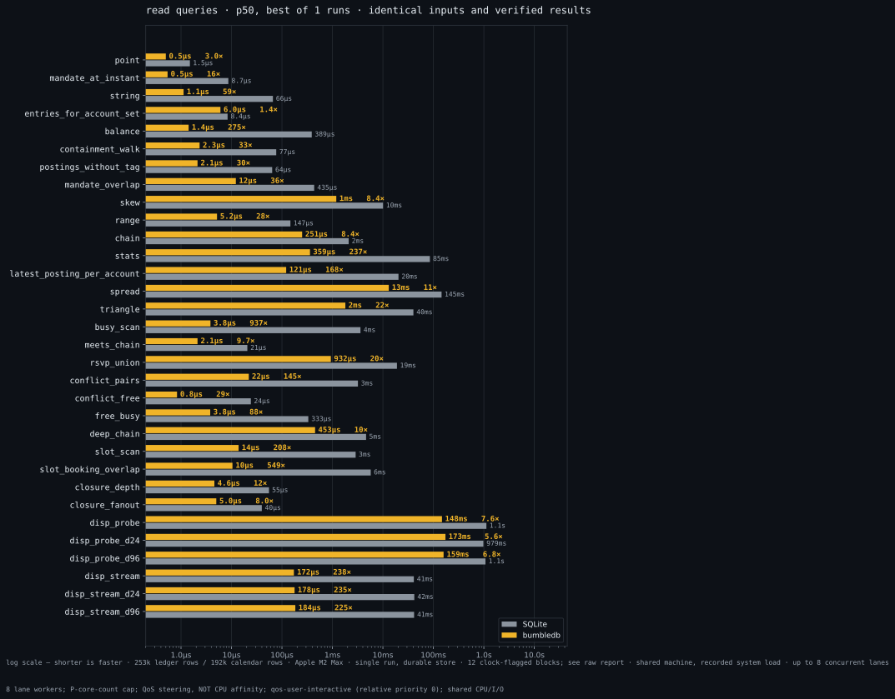

Across those 33 queries, Bumbledb's median latency has a **26.6× geometric
mean speedup** over SQLite for the durable store. The individual results range
from **3.8×** for a skewed lookup to **434×** for a calendar scan:

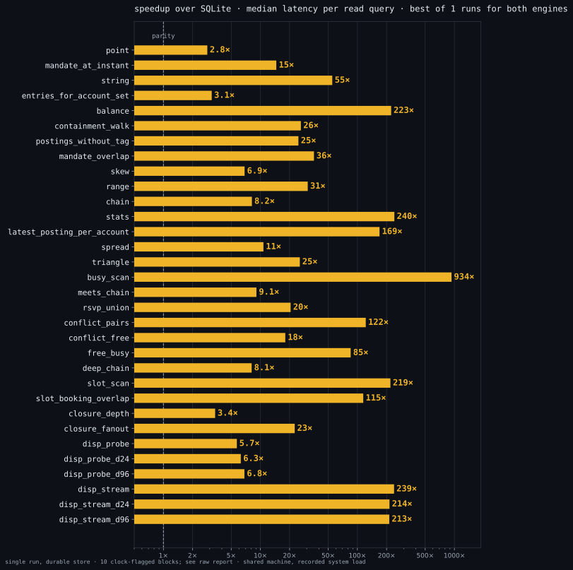

Median latency is only part of the picture. These two views show p50 through
p99 for each query. The `spread` query and the three largest displaced-data
probes exceed the project's 10 ms p99 target; the charts include those misses
rather than reducing the dataset or dropping the queries.

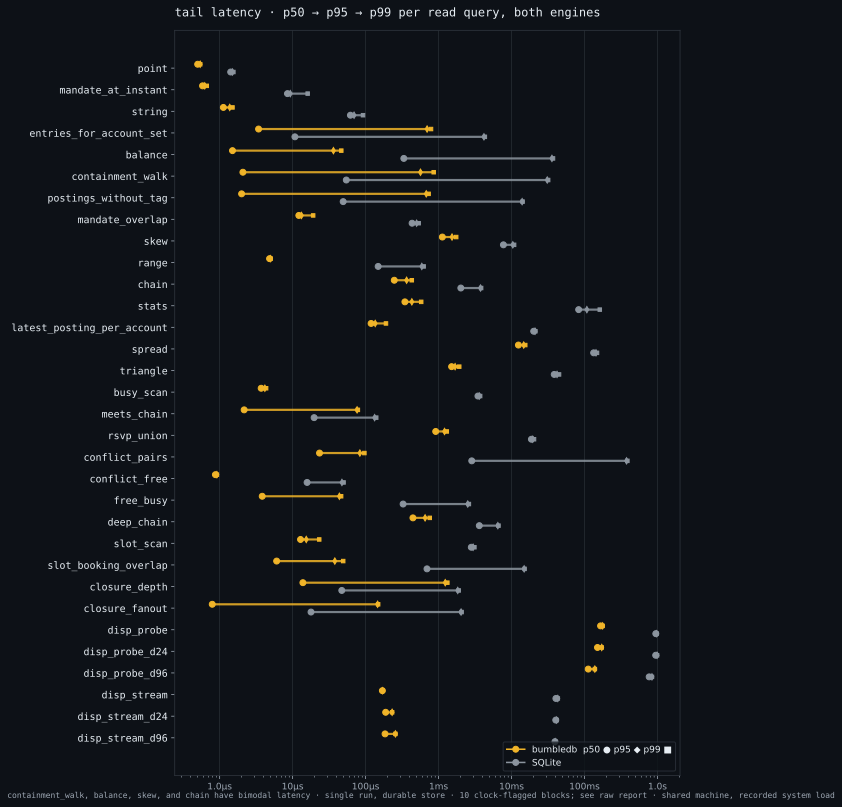

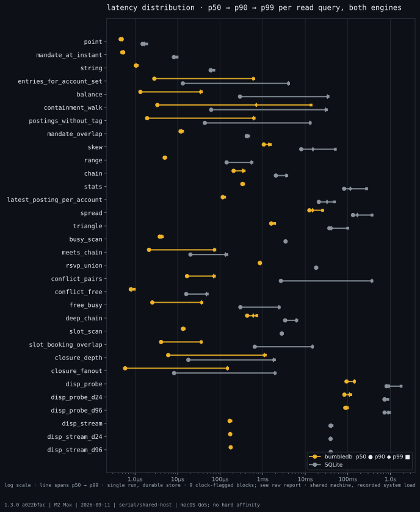

The complete comparison below combines the primary reads with the additional
workloads. Red bars are operations where SQLite is faster. Two SQLite queries
that exceeded the one-second limit are counted but do not receive invented
ratios.


### Additional workloads

The broader suite covers joins, graph queries, analytical rollups, point
lookups, cyclic joins, and time intervals. Across the 34 comparisons that
finished in both engines, Bumbledb's median latency has a **21.8× geometric
mean speedup**. Two direct SQL translations exceeded the one-second limit.

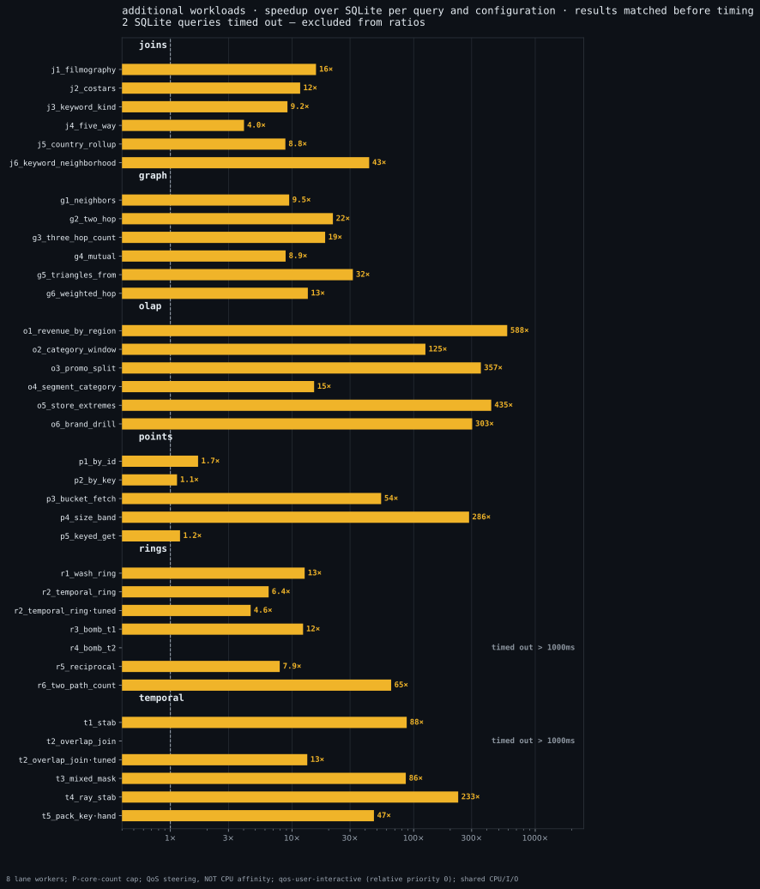

The join tests use IMDB-shaped data and range from two-way to five-way joins:

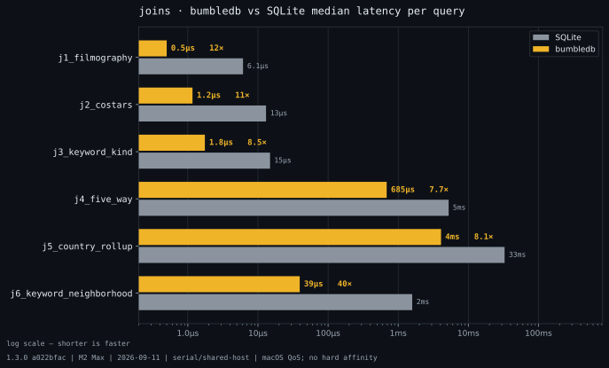

The graph tests cover neighborhoods, two-hop paths, mutual edges, and
triangles:

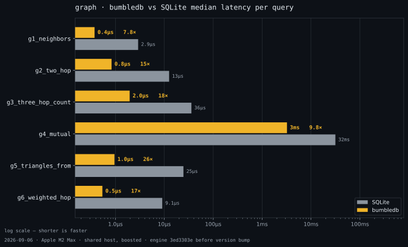

The analytical tests cover grouped totals, windows, and drill-downs:

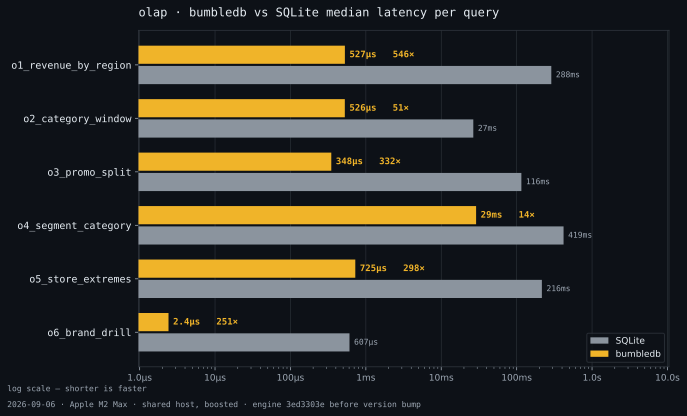

Point reads are close because they play directly to SQLite's B-tree
implementation. Bumbledb is **3.3×** faster on the closest prepared lookup and
**1.5×** faster on its typed keyed read:

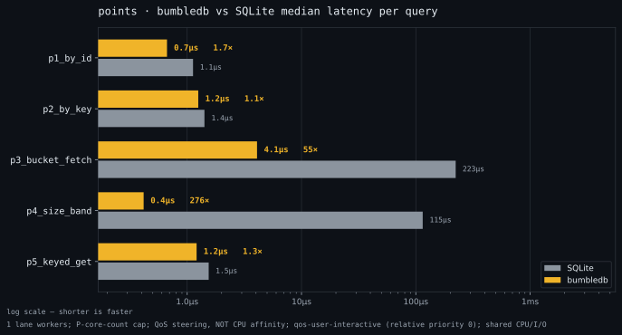

Cyclic joins are a difficult case for a fixed sequence of binary joins.
Bumbledb is **11.2×** faster on the first ring query and **9.6×** faster on
the first bipartite stress test:

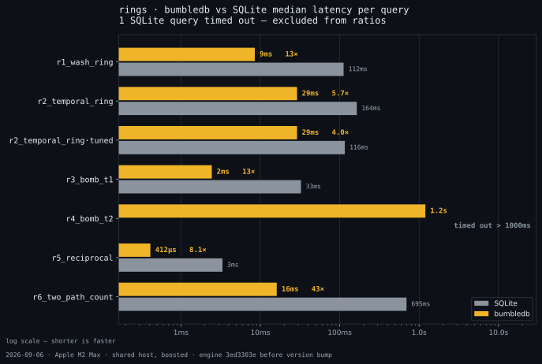

The time tests cover point membership, overlaps, open-ended intervals, and
merging adjacent ranges. Hand-written SQLite alternatives are shown beside
the direct translations where they materially improve the comparison:

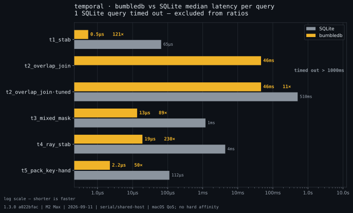

### Queries that timed out in SQLite

SQLite's stress-test queries were limited to one second per sample. Two direct
translations exceeded that limit on every attempt. Bumbledb completed the
larger bipartite join in **1.77 seconds** and the interval-overlap join in
**50.2 milliseconds**. A hand-written SQLite version of the overlap query did
finish; Bumbledb was **10.7×** faster than that version.

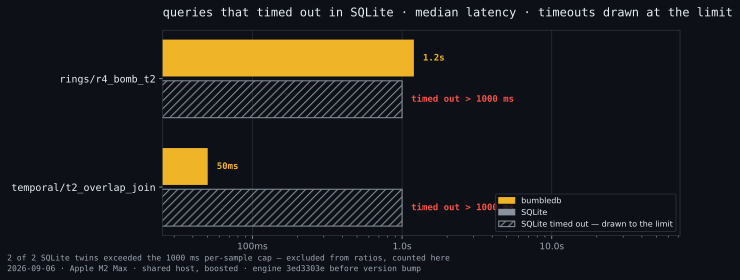

### Where SQLite is faster

The transaction benchmark measures keyed reads, inserts, updates, upserts,
read-modify-write operations, deletes, and a 90/10 read/write mix with matching
durability settings. SQLite is faster on 20 of the 22 comparisons and has a
**1.80×** geometric mean advantage overall. Bumbledb wins the keyed reads, but
SQLite's write path is substantially faster for large batches when durability
is disabled.

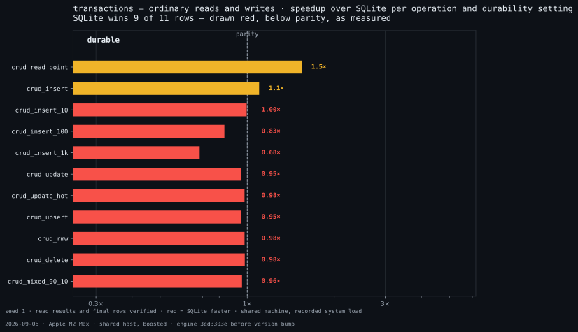

The constraint benchmark compares Bumbledb's keys, references, conditional
references, fixed sets, and resource limits with SQLite
`UNIQUE`/`FOREIGN KEY`/`CHECK`/trigger implementations. SQLite is faster on
10 of 12 comparisons. Successful durable commits are close, while SQLite
rejects invalid writes much faster. The largest gap is a failed durable key
check: Bumbledb spends 4.64 ms because its never-reuse ID guarantee is itself
persisted, while SQLite returns after 8.33 µs.

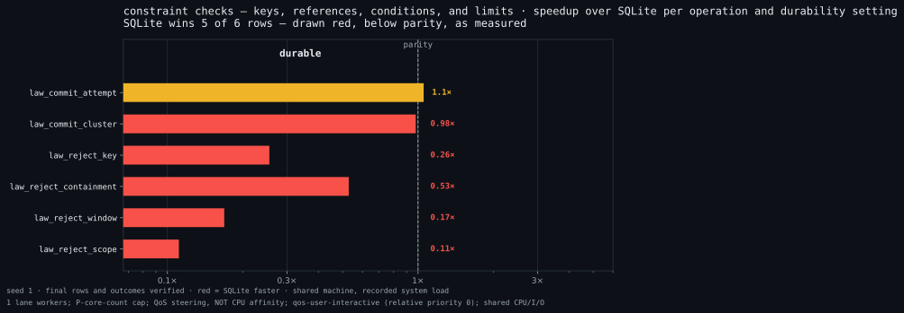

### Writes

Durable single-record commits are dominated by the storage flush in both
engines: Bumbledb measures 4.72 ms at p50 and SQLite 4.26 ms. SQLite is also
faster on a large collection insert, completing it in 0.74 seconds compared
with Bumbledb's 0.78 seconds.

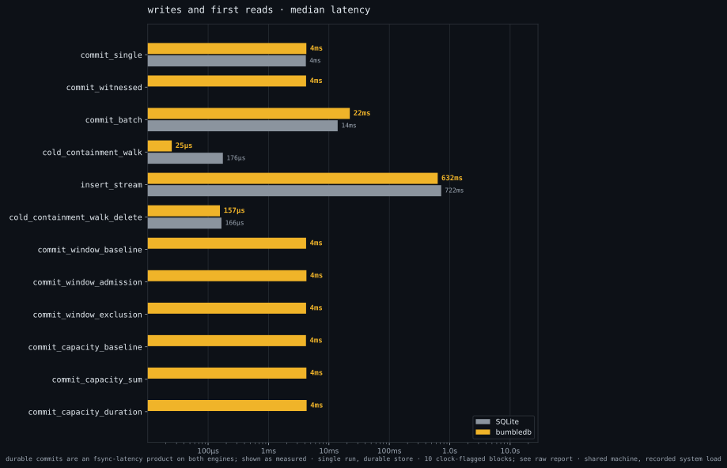

The full throughput test covers insert and delete batches of 1, 10, 100, and
1,000 records with and without durability:

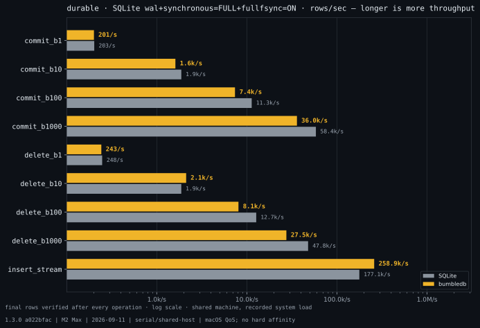

The same results plotted against batch size show where flush latency stops
dominating and record processing becomes visible:

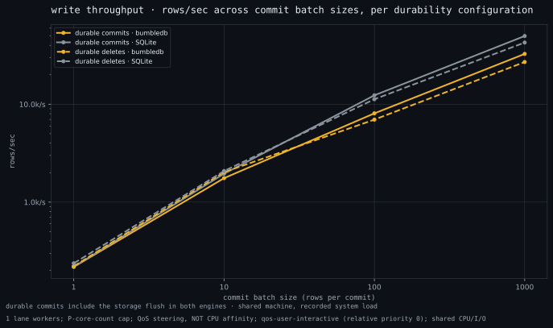

### Disk usage

After compaction, Bumbledb uses approximately **167 bytes per ledger row** and
**228 bytes per calendar row**. Indexed SQLite uses 73 and 93 bytes
respectively. Bumbledb spends the additional space on the indexes used for
keys and constraints and on the read representation that supports its query
performance.

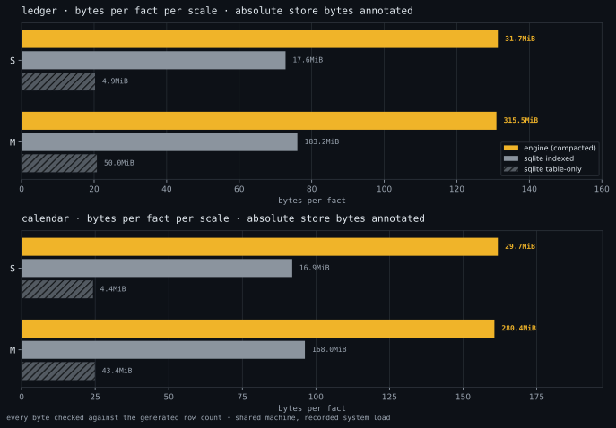

### Scale and cold starts

The scale test repeats four representative queries at the published dataset
sizes. The calendar scan is **442×** faster than the direct SQLite query and
**155×** faster than a hand-written alternative; the triangle query is
**15.5×** faster, and the recursive fan-out query is **35.4×** faster.

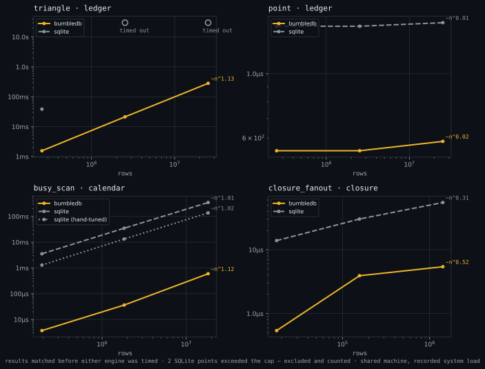

The first query after opening a database includes work that later executions
reuse. SQLite is faster on the cold recursive fan-out query, at 16.5 µs versus
Bumbledb's 686 µs. Once warm, Bumbledb completes it in 1.04 µs versus SQLite's
11.8 µs.

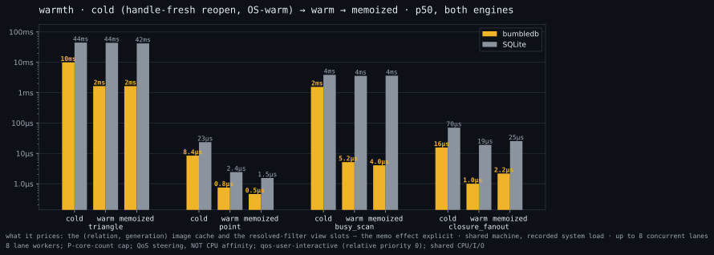

### Performance after repeated updates

The long-running update test starts with 100,000 records and performs 10,000
delete-and-insert cycles. It includes a steady workload, the same workload
without durability, and a delete-heavy workload. One SQLite configuration
runs periodic `VACUUM` and `ANALYZE`, with that maintenance time included in
its throughput.

On the durable steady workload, SQLite's window-probe latency rises from 300
to 564 µs while Bumbledb remains between 20 and 21 µs. Bumbledb's store grows
from 74.5 to 83.0 MB; SQLite's unmaintained store grows from 14.8 to 17.4 MB,
and periodic `VACUUM` reduces it to 13.2 MB. SQLite remains ahead on durable
write throughput, while Bumbledb is ahead with durability disabled.

Probe latency:

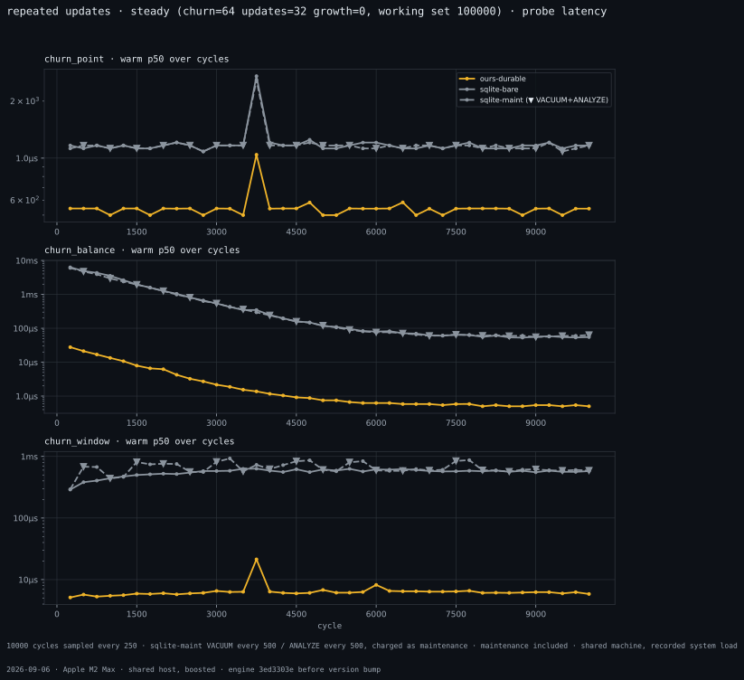
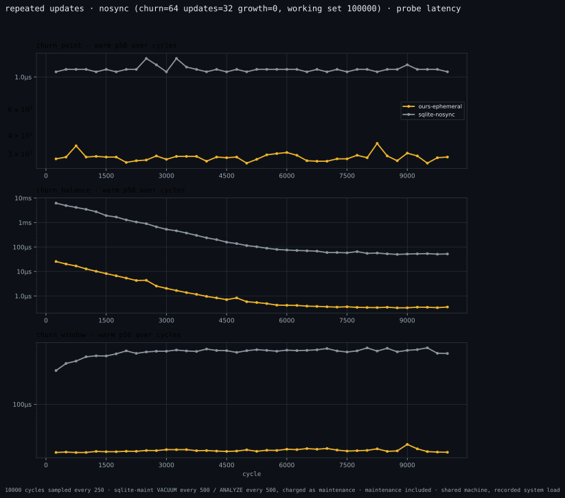
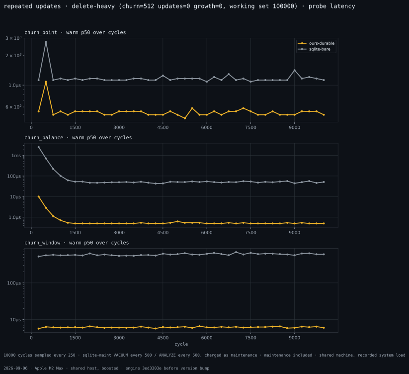

Store size:

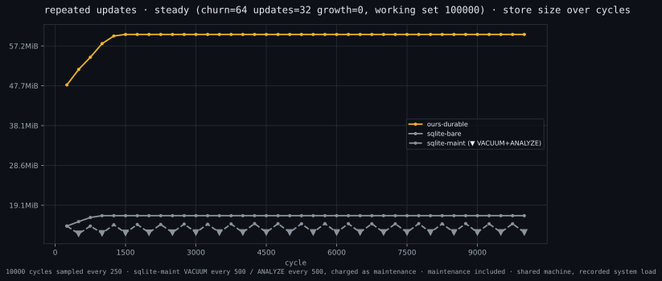
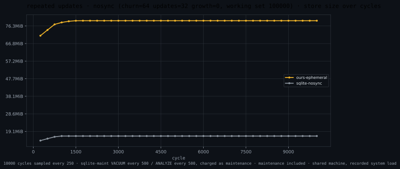
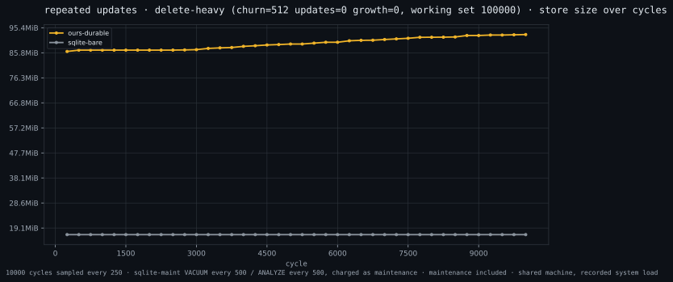

Write throughput:

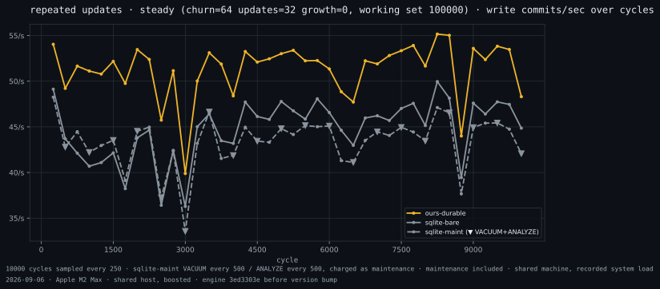
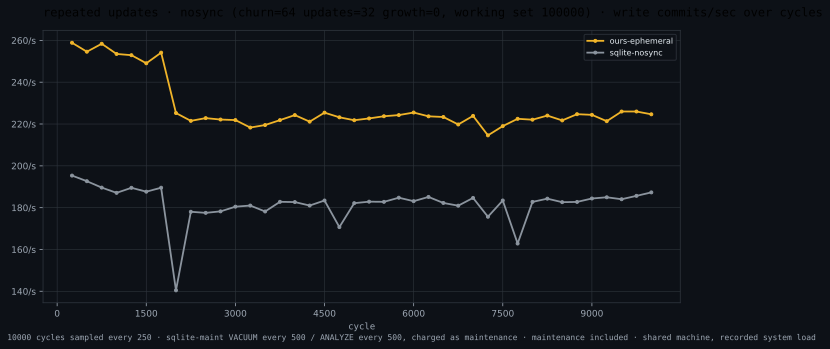
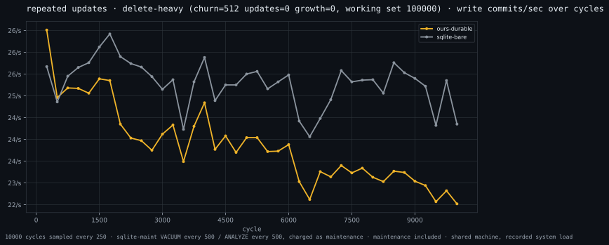

### Heap instance versus the leased store

The same ledger corpus, published once into a durable store and once into an
`OwnedInstance`, is compared on point reads. Heap `get` is 167 ns against
LMDB's 250 ns; `contains` is 334 ns against 458 ns. Admission cost on this
night rose from 716 ns/fact at 693 facts to 1,016 ns/fact at 41,432 facts.
The primer four-prefix gate stayed blocked: the source JSONL and completed
store are on disk, but the opener still needs a fingerprint-matching Rust
`SchemaDescriptor` for StandardsEvidenceIR.

### Reproducing the benchmarks

The complete benchmark run is one command:

```sh
scripts/bench-night.sh bench-out/night-$(date +%F)
```

It generates and verifies the datasets, runs the durable and non-durable
comparisons, exercises the additional workloads, measures storage and writes,
runs the heap-versus-store ladder, performs the long-running update test, and
records the machine state around each timed section. The full configuration
and individual commands are in
[the benchmark guide](docs/architecture/61-bench-lanes.md).

## Why reads are fast

Most of the read performance comes from a few structural choices.

Relations are decoded into columnar in-memory data once per database version
and shared by prepared queries. A lazy trie index is built only to the depth a
query actually needs, so a join does not pay to construct unused levels.

The executor uses Free Join, an algorithm that can choose between traditional
binary-join behavior and worst-case-optimal join behavior within the same
plan. This matters for graph and cyclic queries, where committing to one fixed
binary join order can produce very large intermediate results.

Probes run in batches of roughly 128. The engine first computes their hashes,
then issues independent memory lookups together so the processor can overlap
cache misses. Failed probes are removed from the batch without a branch for
each row.

Finally, set semantics remove work. Relations contain no duplicate records,
inserts and deletes are idempotent, and query unions are already distinct.
Prepared queries reuse their plans, temporary storage, indexes, and output
buffers, which is why an execution within previously seen sizes performs no
heap allocation.

The detailed execution model, including the planner, trie layout, vectorized
kernels, interval index, and assembly checks, is documented in
[Execution](docs/architecture/40-execution.md).

## Schemas and queries

The schema macro supports six stored value representations plus fixed
relations:

| Type | Use | Comparisons and operations |
|---|---|---|
| `u64` | IDs, counts, and unsigned values | equality, ordering, parameter sets, numeric aggregates |
| `i64` | signed values, timestamps, and money under a host type | equality, ordering, parameter sets, numeric aggregates |
| `bool` | true or false | equality |
| `str` | UTF-8 text that may repeat | equality and parameter sets |
| `bytes<N>` | fixed-size hashes and binary identities | equality and parameter sets |
| `interval<E>` | nonempty half-open ranges | point membership, overlap and Allen relationships, duration, merging |
| `interval<E, w>` | fixed-width half-open ranges | the same interval operations |
| `closed relation` | a fixed enum-like set, optionally with columns | equality, parameter sets, filtered references, joins |

Text is interned because application data often repeats it. Fixed-size byte
values stay inline because hashes and identifiers generally do not. Intervals
store ordered endpoints and may use the largest endpoint to represent an
open-ended range.

The `as NewType` field modifier emits a Rust newtype for nominal safety.
`fresh` asks the database to generate never-reused `u64` values and
automatically makes that field a key.

Queries are plain data after macro or builder expansion. They can be stored,
composed, prepared once, and executed repeatedly with different parameters.
The engine supports multiple rules whose results are combined as a set,
negated records, comparisons, set-valued parameters, `Count`, `Sum`, `Min`,
`Max`, interval duration and merging, named intermediate results, and one
linear recursive query for reachability.

The raw query representation remains public for language bindings and tools.
The Rust `query!` macro and TypeScript builder are conveniences over that same
representation rather than separate query engines.

## Architecture

The architecture documents describe the behavior that the implementation is
expected to preserve:

| Document | Contents |
|---|---|
| [Product](docs/architecture/00-product.md) | workload, process model, durability, supported platforms, and deliberate boundaries |
| [Data model](docs/architecture/10-data-model.md) | stored types, intervals, set semantics, and identity |
| [Queries](docs/architecture/20-query-ir.md) | records, negation, comparisons, parameters, aggregates, and recursion |
| [Constraints](docs/architecture/30-dependencies.md) | keys, references, conditional rules, interval rules, and commit checking |
| [Execution](docs/architecture/40-execution.md) | planning, Free Join, indexes, batching, and vectorized operations |
| [Storage](docs/architecture/50-storage.md) | LMDB layout, dictionaries, indexes, transactions, and cached read data |
| [Validation](docs/architecture/60-validation.md) | reference comparisons, randomized tests, benchmark design, and reproducibility |
| [API](docs/architecture/70-api.md) | database lifecycle, reads, writes, point lookups, prepared queries, and export/import |

The implementation of Free Join follows Wang, Willsey, and Suciu,
*Free Join: Unifying Worst-Case Optimal and Traditional Joins* (SIGMOD 2023),
with the engine's differences documented alongside the code. The paper is
included under [`docs/free-join-paper/`](docs/free-join-paper/).

The Rust engine, TypeScript package, and C ABI all use the shared schema and
query definitions in this repository. [`lean/`](lean/README.md) contains an
executable specification of values, queries, plans, and constraints. The
checked-in examples are evaluated by the engine, a straightforward reference
implementation, and Lean, and the test fails if the results differ.

## Correctness and performance testing

The benchmark results are backed by checks that run before timing:

- The query suite and randomized query generator compare result sets with
  SQLite.
- Randomized write sequences compare accepted commits, rejected commits,
  reported constraints, and resulting records with an independent
  implementation.
- A successful verification records the exact binary, schema, dataset, and
  configuration. The benchmark refuses to reuse that result for a different
  binary or input.
- A machine-wide lock prevents two benchmark processes from timing
  simultaneously. Processor frequency is sampled around timed sections, and
  affected readings are marked in the raw report.
- Machine-code checks verify important properties of hot loops, including the
  absence of calls and fallback byte comparisons.
- A counting allocator verifies that warm prepared-query execution performs no
  allocations.
- CI runs formatting, linting, tests, documentation examples, feature
  combinations, the portable scalar implementation on Linux x86-64, and the
  native Apple Silicon implementation on macOS.
- The Lean build accepts no unfinished proofs, and its executable results are
  compared with the Rust engine and the independent implementation.

An optimization is kept only when its benchmark demonstrates an improvement.
Failed experiments are removed rather than left behind as optional modes.

## Repository layout

```text
crates/bumbledb/               database engine
crates/bumbledb-macros/        schema! macro
crates/bumbledb-query/         Rust query API
crates/bumbledb-query-macros/  query! macro
crates/bumbledb-theory/        shared schema representation
crates/bumbledb-c/             C ABI
crates/bumbledb-bench/         verification and benchmark suite
ts/                            TypeScript package and native bridge
lean/                          executable specification
docs/                          architecture, cookbook, and references
scripts/                       tests, benchmark runner, and chart generation
```

The main Rust checks are:

```sh
cargo fmt --all --check
cargo clippy --workspace --all-targets -- -D warnings
cargo test --workspace
cargo test --workspace --doc
```

`scripts/check.sh` runs the larger combination of feature, allocation, and
platform checks. `scripts/lean.sh` builds the specification and compares its
results with the engine.

## Current release

Version **0.15.0** covers the Rust engine, C ABI, and
`@bjornpagen/bumbledb` TypeScript package. The C ABI version is **3**.
Storage format is **8**.

Bumbledb uses one writer and concurrent snapshot readers. The engine owns no
threads, does not open a network port, and keeps query execution in the
caller's thread. Stores reserve a fixed 32 GiB LMDB address range without
preallocating a 32 GiB file. When a schema changes, data is exported and
imported into a new store rather than migrated in place.

The TypeScript binary currently ships for macOS ARM64. The Rust workspace is
tested on macOS ARM64 and Linux x86-64; other 64-bit targets use the portable
implementation but are not part of the published performance results.

## License

[0BSD](LICENSE). Use Bumbledb for any purpose without an attribution
requirement.
