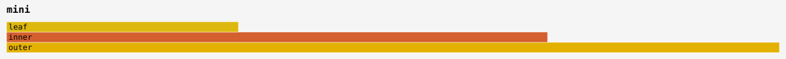
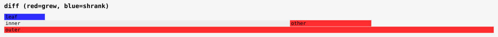

# Bumbledb 1.0.1 benchmark results

The complete local suite finished on **September 7, 2026, at 09:41 CDT**:
**15 lanes, 32 read families, 34 scenario queries, and two 10,000-cycle churn
workloads**. The pre-timing oracle passed **2,879 cases**. This page includes
every current benchmark chart, the full read/scenario tables, and the slower
results as well as the improvements.

Subsequent development experiments are recorded separately in the
[autoresearch notes](autoresearch.md). The release measurements below remain
unchanged.

## Measurement identity

- Source: `5e83ee60c4e5d88e8ca395daa3de4d92a0c03186`, crate version **1.0.1**.
- Run: `release-1.0.1-20260907-5e83ee60/full`; fresh isolated corpus, seed 1.
- Frozen executable SHA-256: `f25c5bfcb2fc89bb24c4eef351c2914a89f32353f8247810499311acc1ae9bf0`.
- Host: Apple M2 Max, 96 GiB RAM, macOS 15.7.7, AC power, 16 KiB pages.
- Toolchain: `nightly-2026-08-15`, ordinary optimized release build.
- Command: `scripts/bench-night.sh <fresh-output> --full --shared`, with
  `BUMBLEDB_BENCH_BIN` selecting the frozen executable and
  `BUMBLEDB_BENCH_DATA` selecting the isolated corpus.

These are **shared-machine, scheduler-boosted observations**, not quiet-host
or cross-platform guarantees. Measurements ran serially under the repository's
measurement lock. Raw reports retain load observations, clock flags, caps,
and the actual source identity; later documentation commits do not change
which executable was measured. No new profiles were captured.

The full manifest, raw reports, run log, source snapshot, and provenance
are retained for the 1.0.1 release evidence archive. The [1.0.0 release](https://github.com/bjornpagen/bumbledb/releases/tag/v1.0.0)
retains the previous published evidence and charts. Its engine source was
`3ed3303eb226de6c98955ab75c296887eaf7704b` and its reports correctly retain
the pre-cutover `0.20.3` version label. Nothing here relabels those old runs.

## Coverage and limits

All ordinary lanes report `RUN-OK`: storage; warm, cold, large-result and
tenant application lifecycles; hash probes; reads; scenarios; CRUD; lawful
admission; writes; S/M/L scale and warmth curves; churn; heap; and Primer-shaped
work. The complete runner is used, not its compact default subset.

The main read comparison reports **`all_win=true` against SQLite**, while
the informational latency-budget aggregate remains **`budget_ok=false`**.
Neither is a verdict that every workload beats SQLite or every historical
Bumbledb revision. Mutation and admission results below include SQLite wins.
Scenario and scaling timeouts remain caps, never invented latency values.

The manifest's external prerequisites remain `NOTRUN-PREREQ`. Real-S3/IAM,
Graviton performance, Linux Node application timing, and a populated store
larger than available memory were **not run**. Separate correctness CI,
including Miri, passed on the measured revision before timing; a benchmark
manifest does not substitute for that evidence. Hash one-shot/streaming
equivalence passed, but known-answer vectors were not supplied: hash KATs
and reused-state hash timing remain **not run**.

## Compared with the last published results

This is one completed run against the single run published with 1.0.0,
on the same M2 Max with the same workload settings and scheduler-boost mode.
It is **not** an alternating controlled experiment or a causal speedup claim.
Read-family medians: **22 lower, 4 unchanged, 6 higher**.
Scenario medians: **21 lower, 3 unchanged, 10 higher**.
Tiny differences can reflect timer granularity or ambient load.

| Selected workload | 1.0.0 median | 1.0.1 median | Median change | Mean change |
| --- | --- | --- | --- | --- |
| Aggregate statistics | 392.167 µs | 345.792 µs | -11.8% | -11.0% |
| Triangle join | 1863.291 µs | 1509.042 µs | -19.0% | -19.1% |
| Slot-booking overlap | 17.542 µs | 6.042 µs | -65.6% | -30.7% |
| Chain join | 215.375 µs | 247.208 µs | +14.8% | +1.3% |
| Closure depth | 4.458 µs | 13.834 µs | +210.3% | -9.1% |
| Store min/max aggregation | 0.725 ms | 0.522 ms | -28.0% | -24.4% |
| Reciprocal-ring query | 0.412 ms | 0.482 ms | +17.0% | +92.8% |
| Temporal overlap join | 50.265 ms | 64.865 ms | +29.0% | +34.0% |
| Construct and deliver 100,000 rows | 69.338 ms | 63.864 ms | -7.9% | -7.4% |
| Small-tenant activation | 0.455 ms | 0.593 ms | +30.2% | +58.0% |

Point lookup and range-query medians are unchanged at **0.500 µs** and
**4.833 µs**. Compacted S/M storage sizes are byte-for-byte unchanged.
The large-result path delivers the same 1,600,000 total rows over 16 draws;
its median is 7.9% lower than the last published full-suite result.
The older 65–66 ms versus 796–801 ms alternating controls belonged to the
1.0.0 development round, not a newly measured 1.0.1 comparison.

There are real observations to follow up, not just wins: temporal-overlap
mean latency rose 34%, reciprocal-ring mean latency rose 93%, and tenant
activation mean latency rose 58%. Tail spikes also increased for several
scenario queries, especially `p2_by_key`, `r5_reciprocal`, and
`t2_overlap_join`. Those scenario reports lack per-cell clock diagnostics,
so the spikes are not dismissed as clock noise. Many mutation cells carry
clock-contamination flags in both rounds. No mechanism is established here.

Medians alone can mislead on a hit/miss or differently sized draw roster:
closure-depth's median rose about 3.1× while its mean fell 9.1%;
closure-fanout's median fell 93.5% while its mean fell only 5.5%.
Interpret means, tails, output work, and raw draws together.

## Native application lifecycle

Protocol 2 measures actual native query/result work, excluding TypeScript
serialization, Effect overhead, network delivery, and hosted activation.
Cold-open is not a flushed operating-system page cache.
All figures in this table are **microseconds**.

| Workload | Median | Mean | p99 |
| --- | --- | --- | --- |
| Warm prepared account projection | 1.708 | 1.702 | 1.750 |
| First query after related delete/insert | 3590.500 | 3650.721 | 4459.000 |
| Open, prepare and query | 343.833 | 392.771 | 1007.000 |
| Construct and deliver 100,000 rows | 63863.750 | 64230.651 | 66317.458 |
| Small-tenant activation | 592.625 | 782.404 | 2686.792 |

The large-result median is **63.864 ms** end to end. Its separately recorded
execution and delivery medians are **56.018 ms** and **7.861 ms**; separate
component medians need not sum to the end-to-end median. Tenant churn retained
zero descriptor growth across its 64 activations.

## Read families

Each sample times one call (256 samples per family). Tables use **microseconds**.
Clock flags describe recorded contamination, not proof of isolation when absent.

| Family | Median | Mean | p99 | SQLite median | Clock flag |
| --- | --- | --- | --- | --- | --- |
| point | 0.500 | 0.479 | 0.542 | 1.417 | none recorded |
| containment_walk | 2.083 | 145.496 | 857.791 | 54.416 | none recorded |
| chain | 247.208 | 224.884 | 429.584 | 2019.416 | none recorded |
| range | 4.833 | 4.828 | 5.000 | 148.667 | none recorded |
| balance | 1.500 | 10.329 | 46.459 | 334.292 | none recorded |
| stats | 345.792 | 361.961 | 578.208 | 83155.334 | none recorded |
| string | 1.125 | 0.992 | 1.500 | 61.958 | none recorded |
| skew | 1127.167 | 1228.819 | 1744.375 | 7741.625 | SQLite |
| spread | 12422.208 | 12526.381 | 15411.750 | 133434.250 | none recorded |
| triangle | 1509.042 | 1527.156 | 1920.667 | 38462.042 | none recorded |
| entries_for_account_set | 3.416 | 171.090 | 787.959 | 10.750 | none recorded |
| postings_without_tag | 2.000 | 161.546 | 730.958 | 49.291 | Bumbledb |
| latest_posting_per_account | 119.000 | 123.065 | 190.250 | 20121.250 | Bumbledb |
| mandate_at_instant | 0.583 | 0.560 | 0.666 | 8.500 | none recorded |
| mandate_overlap | 12.166 | 11.357 | 19.125 | 433.875 | none recorded |
| deep_chain | 445.375 | 400.905 | 757.084 | 3616.834 | none recorded |
| busy_scan | 3.708 | 2.995 | 4.333 | 3464.583 | none recorded |
| meets_chain | 2.167 | 20.022 | 78.375 | 19.709 | none recorded |
| rsvp_union | 914.083 | 960.277 | 1295.709 | 18725.458 | none recorded |
| conflict_pairs | 23.375 | 31.405 | 96.250 | 2850.667 | Bumbledb, SQLite |
| conflict_free | 0.875 | 0.794 | 0.917 | 15.791 | none recorded |
| free_busy | 3.833 | 12.614 | 46.208 | 326.708 | none recorded |
| slot_scan | 12.834 | 10.392 | 23.166 | 2809.916 | none recorded |
| slot_booking_overlap | 6.042 | 16.760 | 49.333 | 694.166 | none recorded |
| closure_depth | 13.834 | 443.295 | 1319.834 | 47.209 | none recorded |
| closure_fanout | 0.792 | 41.301 | 148.625 | 17.875 | none recorded |
| disp_probe | 166000.292 | 164391.975 | 177192.875 | 948619.458 | none recorded |
| disp_probe_d24 | 150524.375 | 153091.107 | 172197.000 | 944873.917 | Bumbledb |
| disp_probe_d96 | 112513.125 | 122302.729 | 138570.541 | 769349.959 | none recorded |
| disp_stream | 169.875 | 169.986 | 171.042 | 40553.791 | none recorded |
| disp_stream_d24 | 188.458 | 193.736 | 231.000 | 40370.875 | none recorded |
| disp_stream_d96 | 184.834 | 201.621 | 256.500 | 39384.625 | none recorded |

Median read latency against indexed SQLite; lower is better.

Read-family median ratios against SQLite, not against historical Bumbledb.

Read medians and tail latencies for both engines.

The p50, p90 and p99 read distributions remain visible together.

Sorted read and scenario median ratios, with capped comparisons excluded.

## Scenario queries

The full six-world roster uses 8 warmups and 64 samples per query.
Times are **microseconds**. A zero answer count for one registered draw does
not mean the entire mixed roster is zero-work. Capped SQLite cells are not
measurements, and these reports have no per-cell clock diagnostics.

| Query | Median | Mean | p99 | SQLite median/outcome |
| --- | --- | --- | --- | --- |
| j1_filmography | 0.459 | 2.377 | 8.083 | 7.084 |
| j2_costars | 1.125 | 6.615 | 23.958 | 12.500 |
| j3_keyword_kind | 1.500 | 4.727 | 18.709 | 15.792 |
| j4_five_way | 1133.792 | 2479.465 | 7732.333 | 5280.625 |
| j5_country_rollup | 4365.291 | 4377.453 | 4772.500 | 32060.375 |
| j6_keyword_neighborhood | 38.166 | 222.595 | 1212.291 | 1608.209 |
| g1_neighbors | 0.416 | 0.733 | 1.916 | 2.875 |
| g2_two_hop | 0.709 | 96.408 | 531.792 | 11.417 |
| g3_three_hop_count | 1.625 | 756.108 | 4677.250 | 34.625 |
| g4_mutual | 3038.584 | 3191.670 | 4497.167 | 30591.375 |
| g5_triangles_from | 0.792 | 6.749 | 25.500 | 24.291 |
| g6_weighted_hop | 0.542 | 2.638 | 9.208 | 8.875 |
| o1_revenue_by_region | 485.917 | 511.565 | 1215.291 | 271290.875 |
| o2_category_window | 444.166 | 364.508 | 1205.542 | 25419.375 |
| o3_promo_split | 335.125 | 338.991 | 373.417 | 113501.542 |
| o4_segment_category | 27773.000 | 27847.044 | 30669.375 | 408676.084 |
| o5_store_extremes | 521.917 | 574.952 | 1565.000 | 212792.750 |
| o6_brand_drill | 2.083 | 1.840 | 3.000 | 603.958 |
| p1_by_id | 0.666 | 0.605 | 0.750 | 1.125 |
| p2_by_key | 1.250 | 2.752 | 52.292 | 1.333 |
| p3_bucket_fetch | 4.125 | 6.122 | 17.083 | 212.417 |
| p4_size_band | 0.542 | 4.469 | 16.458 | 115.500 |
| p5_keyed_get | 1.292 | 1.185 | 1.459 | 1.417 |
| r1_wash_ring | 8021.167 | 6199.926 | 9593.625 | 112241.000 |
| r2_temporal_ring | 25055.750 | 19726.765 | 28434.250 | 168169.708 |
| r3_bomb_t1 | 2670.250 | 2670.434 | 2962.375 | 32985.583 |
| r4_bomb_t2 | 1231286.709 | 1257622.906 | 1967980.625 | exceeded_cap |
| r5_reciprocal | 482.500 | 619.970 | 3845.959 | 3657.917 |
| r6_two_path_count | 12952.500 | 13924.505 | 25829.708 | 694607.417 |
| t1_stab | 0.584 | 5.153 | 13.625 | 6.167 |
| t2_overlap_join | 64864.917 | 67453.165 | 165184.625 | exceeded_cap |
| t3_mixed_mask | 16.250 | 1199.048 | 5978.750 | 1199.375 |
| t4_ray_stab | 17.875 | 14.818 | 66.292 | 4474.542 |
| t5_pack_key | 2.458 | 26.188 | 208.542 | not reported |

The main table shows the canonical `sqlite` lane. The additional tuned and
hand-written comparators are retained below, in **microseconds**; `t5_pack_key`
has only the hand-written islands SQL comparator, not a canonical SQLite lane.

| Query | Additional SQLite lane | Median | Mean | p99 |
| --- | --- | --- | --- | --- |
| r2_temporal_ring | sqlite-tuned | 116486.667 | 91273.384 | 213446.833 |
| t2_overlap_join | sqlite-tuned | 790978.750 | 793349.937 | 925229.083 |
| t5_pack_key | sqlite-hand | 103.375 | 908.484 | 3604.167 |

All scenario queries, including the SQLite cap annotations.

### Multiway joins and country rollups

Multiway joins and country rollups.

### Graph traversal, reciprocal edges and triangle counting

Graph traversal, reciprocal edges and triangle counting.

### Analytic sums, grouped extrema and dimension joins

Analytic sums, grouped extrema and dimension joins.

### Point, key and bucket access

Point, key and bucket access.

### Cyclic and temporal ring workloads

Cyclic and temporal ring workloads.

### Interval stabs, overlap joins and temporal masks

Interval stabs, overlap joins and temporal masks.

Scenario comparisons where SQLite exceeded its cap; caps are not completed timings.

## Durable mutation and admission

Both engine sides retain their documented durable commit contract. On macOS,
the comparisons include media flushes; there is no Bumbledb no-sync lane.
Small durable commits are strongly affected by storage and scheduling.
Times below are **milliseconds** and rates come directly from measured means.

| Operation | Rows/batch | Bumbledb median | SQLite median | Bumbledb rows/s | SQLite rows/s |
| --- | --- | --- | --- | --- | --- |
| commit_b1 | 1 | 4.264 | 4.239 | 225.33 | 228.59 |
| commit_b10 | 10 | 5.690 | 4.693 | 1,748.76 | 2,119.81 |
| commit_b100 | 100 | 11.327 | 6.993 | 8,613.2 | 14,284.74 |
| commit_b1000 | 1,000 | 25.618 | 18.313 | 37,998.57 | 54,665.07 |
| delete_b1 | 1 | 4.170 | 4.253 | 226.84 | 222.27 |
| delete_b10 | 10 | 5.148 | 5.169 | 1,915.18 | 1,917.34 |
| delete_b100 | 100 | 11.969 | 8.348 | 8,717.99 | 12,164.86 |
| delete_b1000 | 1,000 | 35.120 | 21.882 | 28,227.9 | 46,080.23 |
| insert_stream | 200,000 | 649.533 | 738.007 | 305,175.09 | 268,927.99 |

Relative to 1.0.0, single-row commit median fell 11.9%, 1,000-row commit fell
7.4%, and the insertion-stream median fell 1.0%. The 100-row commit and
delete medians rose 2.9% and 7.9%. These are observations from flagged
shared-host runs, not an across-the-board write-speedup claim.

Durable writes and first-read costs from the main comparison runner.

Commit, delete and insertion rates for each supported batch size.

Write throughput across the measured commit and delete batch ladders.

Application CRUD comparisons under matched durability contracts.

Accepted and refused transactions under declared-law enforcement.

CRUD and lawful-admission post-state checks both reported `ok`. Refused-law
samples include validation and abort, not successful commits. Bumbledb emits
the complete violation evidence; SQLite uses its constraint/trigger refusal
and rollback. The charts deliberately retain SQLite's faster refusal cases.

## Storage and scaling

Compacted LMDB file lengths are compared with checkpointed, indexed SQLite
at matching row counts, not RSS or virtual map reservations. Table-only
SQLite has a different indexing contract. Free-page history explains some
raw-versus-compacted growth, not the remaining page and index overhead.

| Scale / world | Facts | Compacted bytes | Indexed SQLite bytes | Ratio |
| --- | --- | --- | --- | --- |
| S / ledger | 253,264 | 33,259,520 | 18,432,000 | 1.804× |
| S / calendar | 192,369 | 31,129,600 | 17,686,528 | 1.760× |
| M / ledger | 2,526,889 | 330,842,112 | 192,147,456 | 1.722× |
| M / calendar | 1,830,369 | 294,043,648 | 176,193,536 | 1.669× |

Compacted storage against indexed and table-only SQLite.

Scale curves exercise S/M/L, reaching **25,263,139 ledger facts** and
**18,210,369 calendar facts**. Their four-family roster is narrower than the
32-family read panel. Two SQLite triangle points reached the timing cap;
they remain excluded-and-counted rather than fabricated results.

| Family | S median (µs) | M median (µs) | L median (µs) |
| --- | --- | --- | --- |
| triangle | 1565.125 | 21286.291 | 281021.959 |
| point | 0.542 | 0.542 | 0.584 |
| busy_scan | 3.709 | 36.334 | 596.875 |
| closure_fanout | 0.542 | 3.916 | 5.416 |

S/M/L scaling for the four registered curve families.

Reopen-cold, warm and memoized execution at the first requested scale.

Reopen-cold creates a new handle and prepared query in the same process with
a warm OS page cache. Open and prepare are outside its timed first execution.
Large populated corpora here do not establish larger-than-memory performance.

## Long-lived churn

Both runs finished **10,000 cycles**, with **40 observation points per lane**.
The table shows the final observation, not a whole-run throughput average.
SQLite maintenance remains an explicitly labeled comparison variant.

| Run / lane | Final commits/s | Final file bytes | Point median (µs) | Window median (µs) |
| --- | --- | --- | --- | --- |
| steady / ours-durable | 55.35 | 62,898,176 | 0.500 | 5.917 |
| steady / sqlite-bare | 50.33 | 17,383,424 | 1.125 | 547.459 |
| steady / sqlite-maint | 47.48 | 13,185,024 | 1.167 | 549.875 |
| delete-heavy / ours-durable | 22.52 | 97,288,192 | 0.541 | 6.042 |
| delete-heavy / sqlite-bare | 24.35 | 17,362,944 | 1.167 | 601.666 |

Engine final file sizes equal the previous run: **62,898,176 bytes** for
steady churn and **97,288,192 bytes** for delete-heavy churn. Final observed
engine throughput changed from 48.31 to 55.35 commits/s for steady churn and
22.41 to 22.52 for delete-heavy; neither pair is a controlled causal estimate.
Changing key distributions can alter balance-probe cost despite constant
working-set size, so do not read every declining curve as an engine speedup.

### Steady churn

steady probe latency over all 10,000 cycles.

steady retained file sizes over all 10,000 cycles.

steady commit throughput, with maintenance events where recorded.

### Delete-heavy churn

delete-heavy probe latency over all 10,000 cycles.

delete-heavy retained file sizes over all 10,000 cycles.

delete-heavy commit throughput, with maintenance events where recorded.

## Heap and Primer-shaped workloads

The heap lane compares a frozen in-memory instance with LMDB access; it is
not an alternative durability promise. Point/access medians are microseconds.

| Operation | Frozen heap | LMDB |
| --- | --- | --- |
| get | 0.167 | 0.625 |
| contains | 0.333 | 0.625 |
| scan | 20.750 | 31.750 |

The four admission prefixes contain 693, 2,633, 10,392 and 41,432 facts,
with observed admission costs of 545.33, 579.65, 646.99 and 700.05 ns/fact.
Publication took **734.096 ms**; the 500-row join took **37.583 µs**.
These are the lane's individual wall measurements, not percentile distributions.

Primer uses **200,000 facts across 12 relations**. Its phase figures are
single measured wall times, not medians; allocations were not instrumented.

| Phase | Rows | Wall time (ms) |
| --- | --- | --- |
| builder_load | 200,000 | 72.833 |
| builder_admit | 200,000 | 231.752 |
| builder_publish | 200,000 | 522.225 |
| delta_create | 0 | 19.507 |
| delta_seed | 99,996 | 240.806 |
| delta_write | 100,004 | 298.838 |
| scan_decode | 200,000 | 23.871 |

## Synthetic renderer examples

These two repository images are **test fixtures**, not benchmarks or captured
profiles. Their invented microsecond values test the renderer's layout and
color rules. They are shown here to make the entire repository image catalog
visible without presenting synthetic data as release evidence.

The miniature fixture checks nested frame widths and labels.

The differential fixture checks red growth, blue shrinkage and unchanged frames.

All **27 measured charts and both synthetic fixtures** are embedded on this
page. See the [measurement runbook](measurement-plan.md) for reproducible
commands and workload boundaries. Compare reports using source, protocol,
draw mix and host—not screenshots alone.
