# BumbleDB 2.0 benchmark results

The full local suite finished on **October 10, 2026 at 19:03 UTC**: **12 measured
lanes, 32 read families, and 34 scenario queries**. The pre-timing oracle passed
**2,879 cases**. Every lane passed. This page includes all **21 charts** and the
workload tables, generated from the checked-in reports.

## Measurement identity

- Source: `7135a9a18f091eabc3f4d345b6e87fb6c9bbcbb9`, crate version **2.0.0**.
  The executable was built from this commit before timing. Later lanes stamp the
  checkout's `HEAD` at run time, which had advanced to `c0e7708a6`; the commits in
  between touch only documentation and a test-only allocation counter.
- Executable SHA-256: `2b7a606251c79936cb9fd00f411ca73402c29089d728692868888b3927cc542c`.
- Host: Apple M2 Max, 96 GiB RAM, macOS 27.0.1, AC power, 16 KiB pages.
- Toolchain: `rustc 1.101.0-nightly (a30aa9064 2026-10-08)`, ordinary optimized release build.
- Run: fresh isolated corpus, seed 1, one lane at a time, started 2026-10-10 18:24 UTC.
- Command: `caffeinate -dims scripts/bench-night.sh bench-out/2.0-rc1-full --full --shared --allow-macos-qos`.

These are **shared-host measurements**. Each measured process set and read back
user-interactive QoS; macOS provides no hard P-core affinity. Other agents were
running on the machine: the 1-minute load average was 9.49 when the read lane
started and 7.22 when it ended, and every report records its own load averages.
Treat absolute latencies as upper bounds on an unloaded machine.

The [run directory](runs/2.0.0/README.md) holds the index, verification log and all
12 raw JSON reports.

## Coverage and limits

The main read panel reports **`all_win=true` against indexed SQLite**: BumbleDB's median
is lower in all 32 read families. The informational latency-budget aggregate is
**`budget_ok=false`**; budgets are not release gates. SQLite has the lower median in
**7 of 9 durable write ladder rows** (BumbleDB leads on `commit_b10`, `insert_stream`),
**11 of 11 application CRUD rows** (all within 0.78–0.99× of SQLite),
**5 of 6 declared-law rows** (the four refusal rows by 1.9× to 7.0×), and three keyed-lookup
scenarios (`p1_by_id`, `p2_by_key`, `p5_keyed_get`). Those results are kept as measured.
Capped comparisons remain caps, not timings.

This run does not qualify real S3/IAM deployments, Graviton or Linux Node application
performance, a Raspberry Pi with 512 MB RAM, or a populated store larger than
available memory.

## Native application lifecycle

Native preparation, execution and paged delivery, excluding TypeScript
serialization, Effect overhead, networking and hosted activation. Cold-open includes
open, prepare, execute and close in one process and does not flush the OS page
cache. The post-write query observes an actual related delete or insert. Tiny-tenant
work opens an existing database, prepares a query, reads five account rows and
closes; creation is excluded. All figures are **microseconds**.

| Workload | Median | Mean | p99 |
|---|---|---|---|
| ledger/warm-prepared-account-projection | 2.458 | 2.460 | 2.667 |
| ledger/first-prepared-projection-after-delete-or-insert | 3,307.458 | 3,375.356 | 4,653.583 |
| ledger/cold-open+prepare+account-projection | 564.458 | 584.512 | 753.375 |
| ledger/posting-query+complete-result+cursor-values | 4,587.875 | 4,653.690 | 5,435.208 |
| ledger-tiny/8-tenants-64-activations | 557.708 | 596.980 | 1,312.542 |

The large-result median is **4.588 ms** end to end. Separately recorded execution and delivery medians are **1.416 ms** and **3.170 ms**; component medians need not sum to the total. The lane delivered 1,600,000 rows. The tiny-tenant lane recorded **0 net file-descriptor growth**. Paging a completed result is not streaming query execution.

## Read families

Each sample times one call; every family has 256 samples. Times are **microseconds**.

| Family | Median | Mean | p99 | SQLite median | SQLite ÷ BumbleDB |
|---|---|---|---|---|---|
| point | 1.208 | 1.235 | 1.625 | 1.458 | 1.2× |
| containment_walk | 2.792 | 207.948 | 2,531.916 | 85.375 | 30.6× |
| chain | 268.209 | 249.200 | 670.000 | 2,775.792 | 10.3× |
| range | 5.750 | 5.914 | 7.833 | 158.375 | 27.5× |
| balance | 2.417 | 18.033 | 78.125 | 396.167 | 163.9× |
| stats | 411.166 | 485.204 | 1,688.500 | 94,696.417 | 230.3× |
| string | 1.833 | 1.665 | 2.000 | 63.541 | 34.7× |
| skew | 1,352.750 | 1,577.099 | 4,177.875 | 8,699.125 | 6.4× |
| spread | 14,788.208 | 16,565.177 | 30,637.375 | 143,458.667 | 9.7× |
| triangle | 1,711.458 | 1,716.835 | 2,135.250 | 39,909.208 | 23.3× |
| entries_for_account_set | 4.250 | 173.868 | 779.208 | 19.583 | 4.6× |
| postings_without_tag | 2.667 | 171.824 | 756.292 | 85.917 | 32.2× |
| latest_posting_per_account | 204.167 | 214.222 | 403.250 | 18,354.958 | 89.9× |
| mandate_at_instant | 1.167 | 1.181 | 1.792 | 8.333 | 7.1× |
| mandate_overlap | 13.834 | 12.833 | 18.833 | 426.042 | 30.8× |
| deep_chain | 469.041 | 435.264 | 772.583 | 4,831.542 | 10.3× |
| busy_scan | 4.917 | 4.479 | 6.875 | 3,578.583 | 727.8× |
| meets_chain | 3.125 | 25.995 | 114.666 | 19.708 | 6.3× |
| rsvp_union | 979.958 | 1,252.483 | 4,204.583 | 11,488.042 | 11.7× |
| conflict_pairs | 23.083 | 33.404 | 100.833 | 3,178.875 | 137.7× |
| conflict_free | 1.375 | 1.329 | 1.584 | 24.375 | 17.7× |
| free_busy | 4.083 | 11.578 | 45.875 | 301.959 | 74.0× |
| slot_scan | 15.541 | 12.144 | 16.667 | 2,674.459 | 172.1× |
| slot_booking_overlap | 12.542 | 21.951 | 58.000 | 725.042 | 57.8× |
| closure_depth | 1.750 | 377.492 | 1,124.792 | 19.875 | 11.4× |
| closure_fanout | 1.459 | 41.276 | 146.417 | 12.750 | 8.7× |
| disp_probe | 167,448.542 | 166,627.618 | 172,573.292 | 894,295.875 | 5.3× |
| disp_probe_d24 | 128,474.709 | 127,685.503 | 138,656.709 | 769,729.458 | 6.0× |
| disp_probe_d96 | 138,691.917 | 140,721.072 | 174,558.083 | 889,633.166 | 6.4× |
| disp_stream | 222.875 | 216.291 | 233.250 | 51,290.917 | 230.1× |
| disp_stream_d24 | 204.584 | 212.163 | 243.333 | 46,330.958 | 226.5× |
| disp_stream_d96 | 230.083 | 238.104 | 266.708 | 46,695.708 | 203.0× |

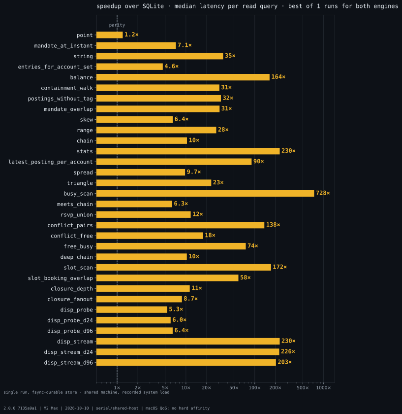

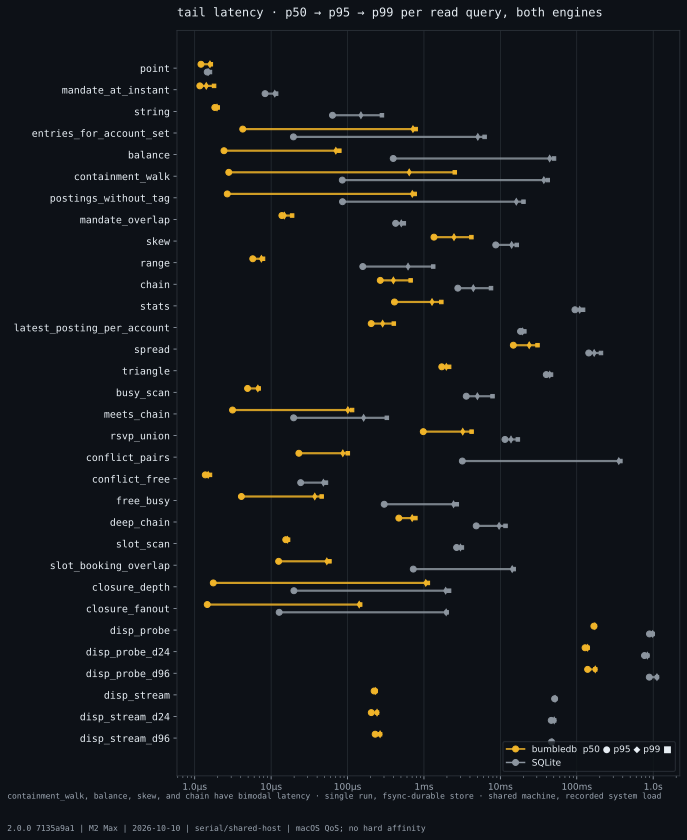

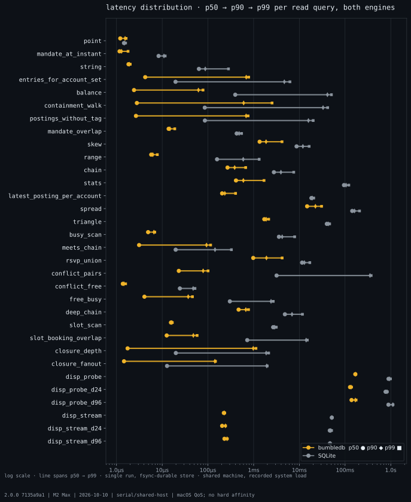

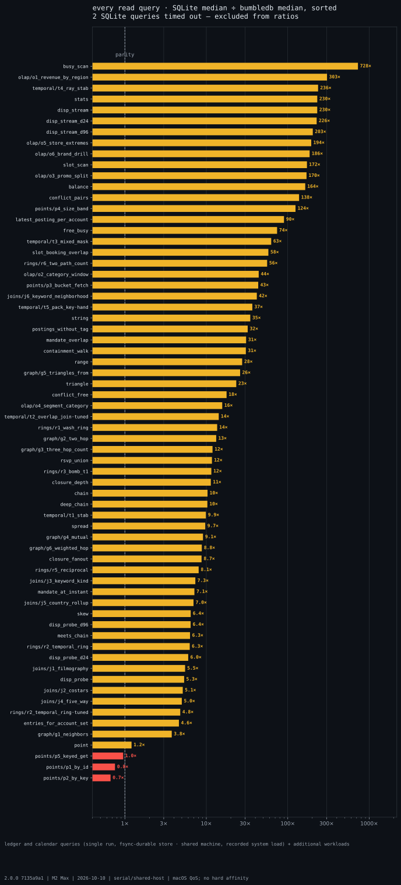

## Scenario queries

All six worlds use 8 warmups and 64 samples per query. Times are **microseconds**.
The main table shows the canonical `sqlite` comparator; tuned and hand-written lanes follow.

| Query | Median | Mean | p99 | SQLite median/outcome | SQLite ÷ BumbleDB |
|---|---|---|---|---|---|
| j1_filmography | 1.458 | 4.576 | 14.958 | 8.000 | 5.5× |
| j2_costars | 2.458 | 11.869 | 75.292 | 12.625 | 5.1× |
| j3_keyword_kind | 2.416 | 6.473 | 26.125 | 17.708 | 7.3× |
| j4_five_way | 1,017.625 | 2,461.545 | 8,360.833 | 5,087.000 | 5.0× |
| j5_country_rollup | 4,331.750 | 4,378.287 | 5,184.458 | 30,158.958 | 7.0× |
| j6_keyword_neighborhood | 38.500 | 214.819 | 819.583 | 1,605.291 | 41.7× |
| g1_neighbors | 1.041 | 1.355 | 3.041 | 3.916 | 3.8× |
| g2_two_hop | 1.541 | 104.722 | 453.791 | 20.375 | 13.2× |
| g3_three_hop_count | 4.209 | 1,197.070 | 9,616.000 | 50.167 | 11.9× |
| g4_mutual | 3,904.125 | 3,895.069 | 4,555.750 | 35,535.083 | 9.1× |
| g5_triangles_from | 1.458 | 8.155 | 34.292 | 37.917 | 26.0× |
| g6_weighted_hop | 1.250 | 3.350 | 15.667 | 11.000 | 8.8× |
| o1_revenue_by_region | 763.833 | 810.723 | 1,438.083 | 231,807.125 | 303.5× |
| o2_category_window | 436.750 | 374.763 | 582.291 | 19,212.792 | 44.0× |
| o3_promo_split | 552.667 | 557.923 | 637.917 | 93,960.667 | 170.0× |
| o4_segment_category | 23,020.625 | 23,477.763 | 27,455.042 | 361,041.084 | 15.7× |
| o5_store_extremes | 773.125 | 824.046 | 2,226.417 | 150,178.041 | 194.2× |
| o6_brand_drill | 3.041 | 2.789 | 4.208 | 564.250 | 185.5× |
| p1_by_id | 1.875 | 1.802 | 2.292 | 1.417 | 0.8× |
| p2_by_key | 2.125 | 1.996 | 2.334 | 1.417 | 0.7× |
| p3_bucket_fetch | 5.542 | 9.652 | 42.500 | 240.416 | 43.4× |
| p4_size_band | 1.000 | 2.303 | 6.292 | 124.500 | 124.5× |
| p5_keyed_get | 3.542 | 3.499 | 13.334 | 3.375 | 1.0× |
| r1_wash_ring | 8,417.083 | 6,584.218 | 10,069.583 | 114,365.167 | 13.6× |
| r2_temporal_ring | 24,816.000 | 19,099.591 | 29,392.792 | 155,263.042 | 6.3× |
| r3_bomb_t1 | 2,727.166 | 2,732.988 | 3,103.333 | 31,432.750 | 11.5× |
| r4_bomb_t2 | 1,283,502.500 | 1,284,605.422 | 1,409,915.167 | cap > 1,000 ms |  |
| r5_reciprocal | 442.875 | 466.018 | 1,431.833 | 3,566.250 | 8.1× |
| r6_two_path_count | 12,679.875 | 12,651.018 | 15,182.708 | 707,711.750 | 55.8× |
| t1_stab | 1.625 | 6.482 | 18.208 | 16.042 | 9.9× |
| t2_overlap_join | 37,451.791 | 37,993.938 | 43,758.958 | cap > 1,000 ms |  |
| t3_mixed_mask | 19.041 | 1,198.960 | 5,246.000 | 1,192.708 | 62.6× |
| t4_ray_stab | 18.583 | 14.236 | 19.000 | 4,380.500 | 235.7× |
| t5_pack_key | 2.833 | 20.694 | 79.584 | not reported |  |

| Query | Additional SQLite lane | Median | Mean | p99 |
|---|---|---|---|---|
| r2_temporal_ring | sqlite-tuned | 118,721.209 | 92,462.201 | 173,174.125 |
| t2_overlap_join | sqlite-tuned | 532,144.667 | 538,427.474 | 642,175.250 |
| t5_pack_key | sqlite-hand | 104.042 | 862.217 | 3,308.125 |

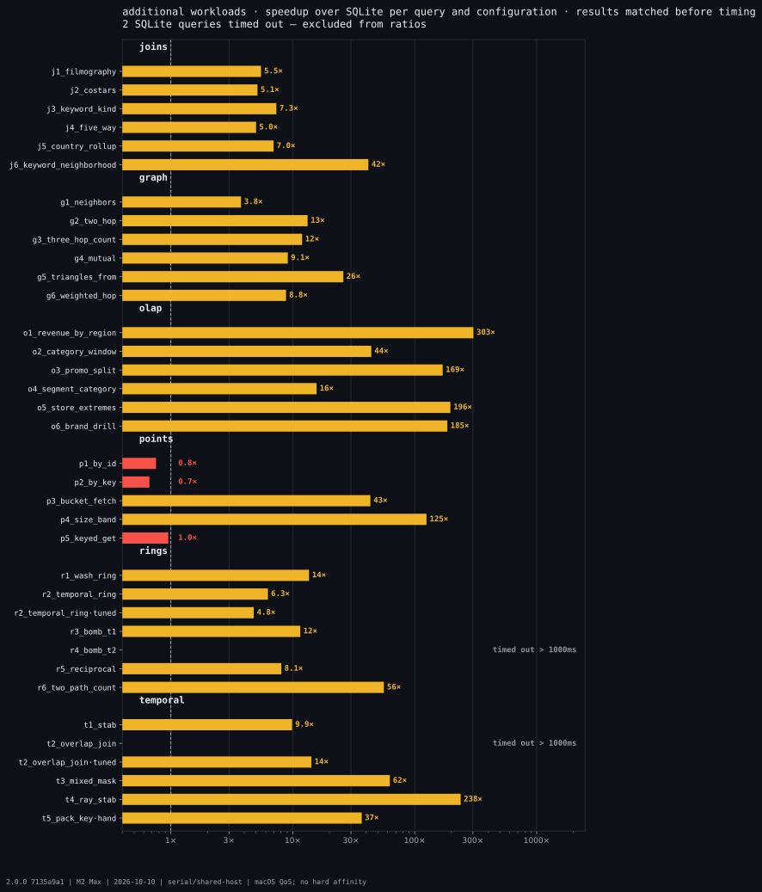

### Multiway joins and country rollups

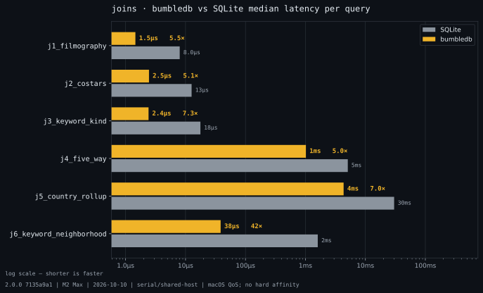

### Graph traversal, reciprocal edges, and triangle counting

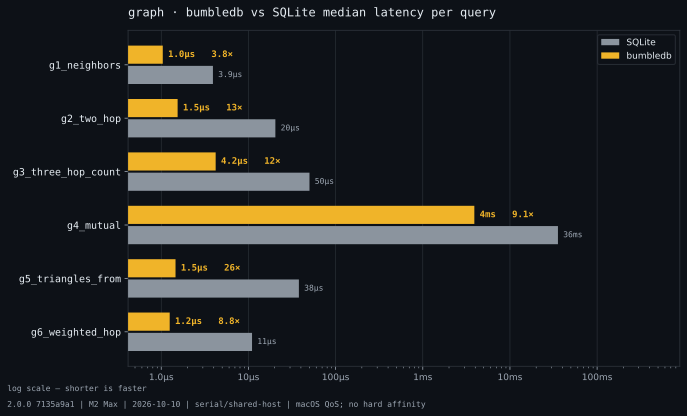

### Analytic sums, grouped extrema, and dimension joins

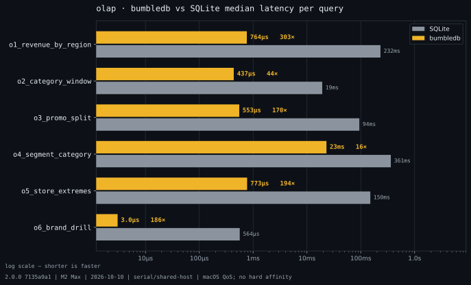

### Point, key, and bucket access

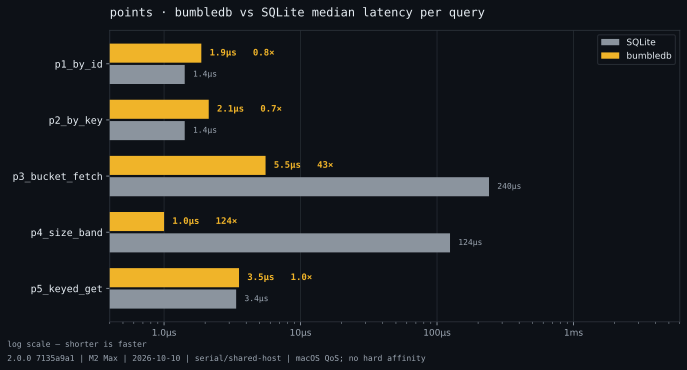

### Cyclic and temporal ring workloads

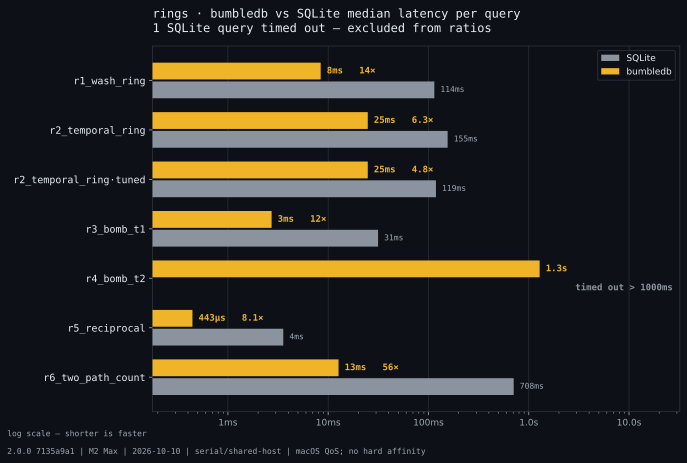

### Interval stabs, overlap joins, and temporal masks

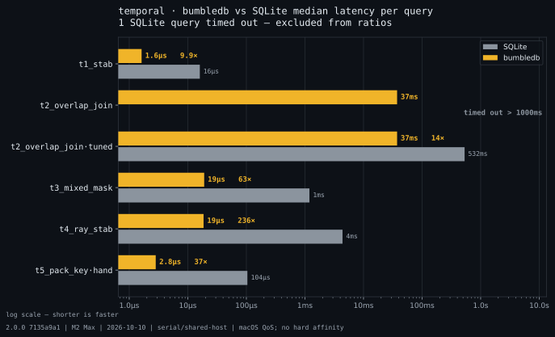

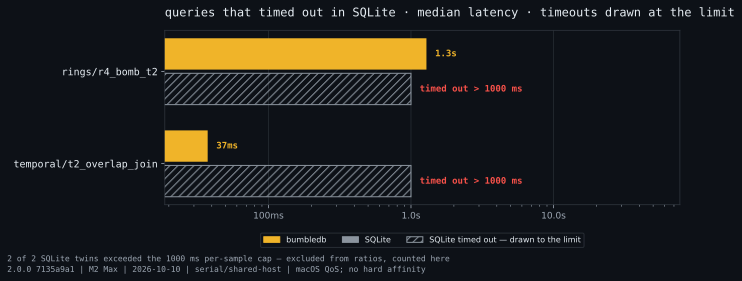

## Durable writes and first-read costs

Both engines keep their documented durable commit contract. On macOS, LMDB issues
media flushes and SQLite uses `wal+synchronous=FULL+fullfsync=ON`. There is no BumbleDB
no-sync lane. Times are **milliseconds**.

| Operation | Rows/batch | BumbleDB median | SQLite median | BumbleDB rows/s | SQLite rows/s |
|---|---|---|---|---|---|
| commit_b1 | 1 | 5.122 | 5.107 | 196.12 | 197.57 |
| commit_b10 | 10 | 6.226 | 6.238 | 1,560.77 | 1,564.76 |
| commit_b100 | 100 | 12.042 | 8.600 | 7,745.00 | 11,444.09 |
| commit_b1000 | 1000 | 32.417 | 19.740 | 31,715.77 | 51,481.90 |
| delete_b1 | 1 | 5.039 | 4.610 | 206.34 | 219.19 |
| delete_b10 | 10 | 6.087 | 5.245 | 1,615.84 | 1,768.28 |
| delete_b100 | 100 | 12.056 | 8.189 | 8,059.99 | 11,808.32 |
| delete_b1000 | 1000 | 38.377 | 23.013 | 25,711.09 | 43,266.93 |
| insert_stream | 200000 | 629.715 | 754.212 | 319,292.32 | 259,824.40 |

The main read runner also measures durable writes and first reads after a mutation.
These are separate workloads from the batch ladder above; figures are **milliseconds**.
Writes occur outside the first-read timer.

| Operation | BumbleDB median | BumbleDB mean | BumbleDB p99 | SQLite median |
|---|---|---|---|---|
| commit_single | 5.100 | 5.304 | 9.401 | 5.064 |
| commit_batch | 30.815 | 30.641 | 33.640 | 16.911 |
| cold_containment_walk | 0.024 | 0.752 | 8.551 | 0.214 |
| cold_containment_walk_delete | 0.179 | 2.580 | 12.614 | 0.213 |
| commit_witnessed | 5.080 | 4.991 | 5.698 | not reported |
| commit_window_baseline | 4.585 | 4.626 | 5.477 | not reported |
| commit_window_admission | 4.996 | 4.890 | 6.058 | not reported |
| commit_window_exclusion | 5.037 | 5.077 | 7.429 | not reported |
| commit_capacity_baseline | 4.217 | 4.343 | 5.338 | not reported |
| commit_capacity_sum | 4.281 | 4.484 | 6.225 | not reported |
| commit_capacity_duration | 4.204 | 4.267 | 5.387 | not reported |
| insert_stream | 710.789 | 716.102 | 750.392 | 776.590 |

`cold_containment_walk` inserts an unrelated Org and does not invalidate queried
relation images. `cold_containment_walk_delete` swaps a Posting, so the query observes a
changed relation. Neither is a cold OS-cache test.

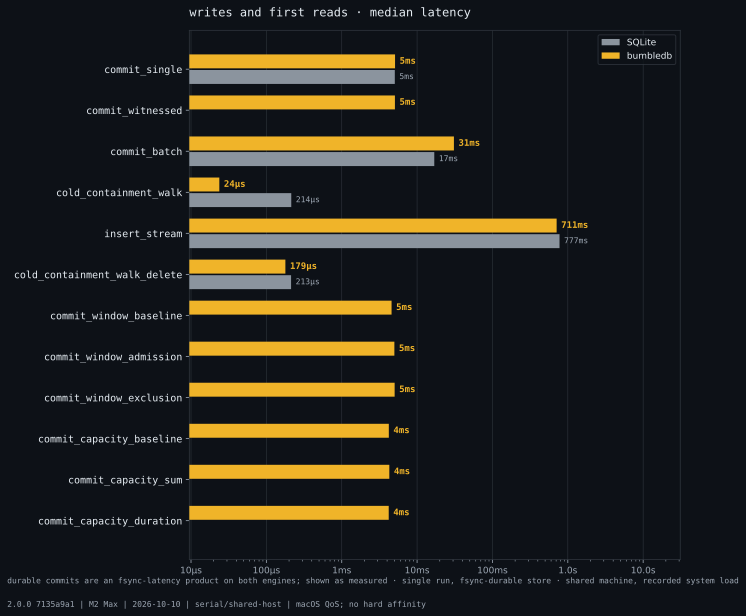

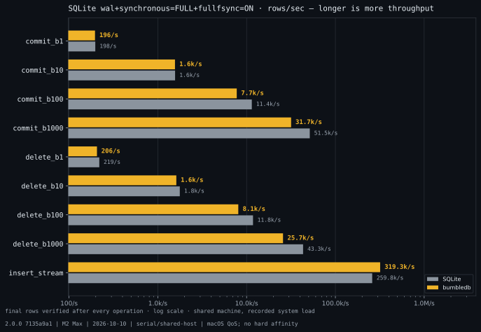

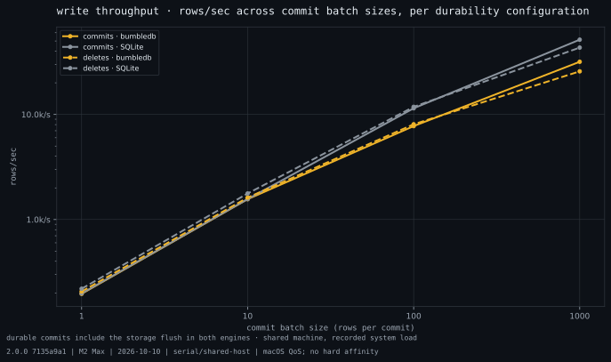

## Application CRUD and declared-law admission

Times are **microseconds** and include means and tails, since durable commits and
refusal paths have different costs. Both post-state checks reported `ok`.
Refused-law samples include validation and abort, not successful commits. BumbleDB
returns complete violation evidence; SQLite uses its constraint and trigger refusal
and rollback. Ratios below 1 are rows where SQLite is faster.

### Application reads and writes

| Operation | Median | Mean | p99 | SQLite median | SQLite ÷ BumbleDB |
|---|---|---|---|---|---|
| crud_read_point | 1.458 | 1.360 | 1.542 | 1.292 | 0.9× |
| crud_insert | 4,200.250 | 4,452.763 | 9,359.458 | 4,173.709 | 1.0× |
| crud_insert_10 | 4,266.250 | 4,686.998 | 8,442.667 | 4,146.084 | 1.0× |
| crud_insert_100 | 5,245.917 | 5,495.372 | 8,633.500 | 4,282.333 | 0.8× |
| crud_insert_1k | 7,071.708 | 7,054.768 | 8,393.291 | 5,481.958 | 0.8× |
| crud_update | 4,844.125 | 5,259.514 | 8,486.250 | 4,184.958 | 0.9× |
| crud_update_hot | 4,285.792 | 4,607.800 | 7,405.042 | 4,169.792 | 1.0× |
| crud_upsert | 4,502.541 | 4,962.097 | 8,052.458 | 4,143.292 | 0.9× |
| crud_rmw | 4,313.792 | 4,593.587 | 7,501.416 | 4,199.000 | 1.0× |
| crud_delete | 4,510.333 | 4,828.980 | 8,204.583 | 4,180.791 | 0.9× |
| crud_mixed_90_10 | 4,402.958 | 4,707.746 | 7,362.833 | 4,188.500 | 1.0× |

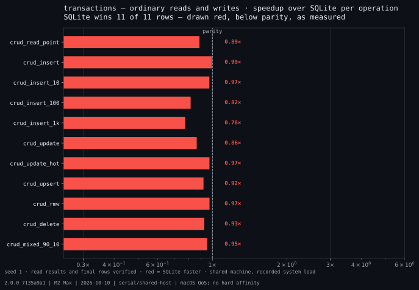

### Accepted and refused transactions

| Operation | Median | Mean | p99 | SQLite median | SQLite ÷ BumbleDB |
|---|---|---|---|---|---|
| law_commit_attempt | 4,427.500 | 4,754.025 | 7,433.458 | 4,430.083 | 1.0× |
| law_commit_cluster | 5,072.666 | 5,034.550 | 7,660.583 | 4,343.542 | 0.9× |
| law_reject_key | 34.750 | 35.386 | 42.125 | 10.333 | 0.3× |
| law_reject_containment | 26.084 | 28.041 | 61.208 | 13.708 | 0.5× |
| law_reject_window | 19.500 | 24.061 | 72.083 | 3.084 | 0.2× |
| law_reject_scope | 20.208 | 21.672 | 68.833 | 2.875 | 0.1× |

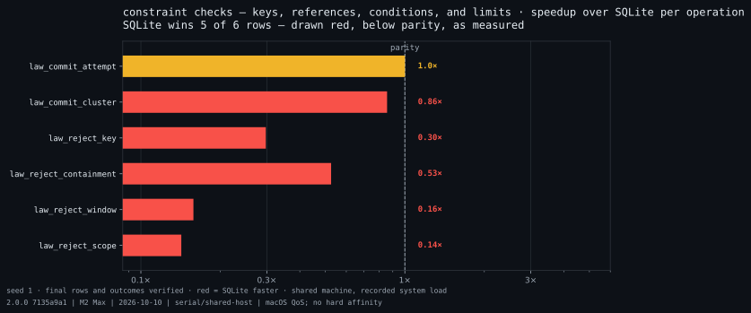

## Storage and scaling

The storage lane compares compacted LMDB file lengths with checkpointed, indexed SQLite
at matching fact counts. These are file sizes, not RSS, physical page residency or
virtual map reservations. Raw LMDB files also contain free-page history.

| Scale / world | Facts | Raw bytes | Compacted bytes | Indexed SQLite bytes | Compacted ratio |
|---|---|---|---|---|---|
| S / ledger | 253,264 | 49,922,048 | 49,610,752 | 18,432,000 | 2.692× |
| S / calendar | 192,369 | 72,777,728 | 72,105,984 | 17,686,528 | 4.077× |
| M / ledger | 2,526,889 | 531,808,256 | 531,496,960 | 192,147,456 | 2.766× |
| M / calendar | 1,830,369 | 669,122,560 | 668,385,280 | 176,193,536 | 3.793× |

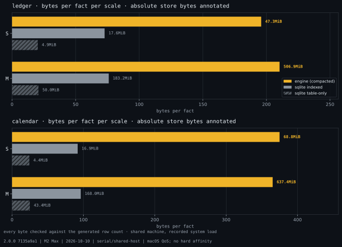

The scale panel covers four families at S, M and L with 64 samples; its roster is
narrower than the 32-family read panel. Times are **microseconds**. SQLite's cap is
30,000 ms per call. A cap during SQLite timing preserves the completed BumbleDB sample.

| Family | Scale | Facts | BumbleDB median | SQLite median/outcome |
|---|---|---|---|---|
| triangle | S | 253,264 | 1,480.208 | 36,958.208 |
| triangle | M | 2,526,889 | 20,530.459 | 500,507.500 |
| triangle | L | 25,263,139 | 299,677.750 | cap > 30,000 ms (timing) |
| point | S | 253,264 | 1.167 | 1.417 |
| point | M | 2,526,889 | 1.208 | 1.375 |
| point | L | 25,263,139 | 1.458 | 1.500 |
| busy_scan | S | 192,369 | 4.417 | 3,305.542 |
| busy_scan | M | 1,830,369 | 35.292 | 31,643.959 |
| busy_scan | L | 18,210,369 | 763.625 | 370,527.250 |
| closure_fanout | S | 17,554 | 1.875 | 15.750 |
| closure_fanout | M | 156,818 | 1.292 | 13.542 |
| closure_fanout | L | 1,418,386 | 46.208 | 106.875 |

The hand-tuned SQLite `busy_scan` comparator is also measured at each scale. Values are **microseconds**.

| Family | Scale | Hand-tuned SQLite median | Mean | p99 |
|---|---|---|---|---|
| busy_scan | S | 1,289.334 | 987.892 | 1,444.625 |
| busy_scan | M | 12,650.334 | 9,873.900 | 14,838.084 |
| busy_scan | L | 150,751.792 | 115,797.179 | 176,039.583 |

The sampled medians can be nonmonotonic across scales; these curves do not establish
asymptotic bounds.

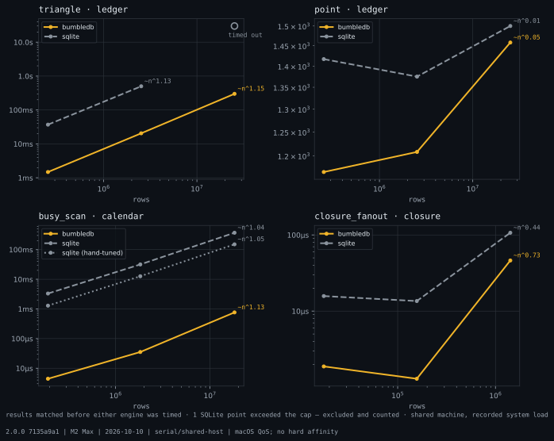

### Reopen-cold, warm, and memoized execution

The warmth panel uses scale S. Reopen-cold makes a new handle and preparation in the
same process with an unflushed OS page cache; open and prepare are outside its
first-execution timer. All values are **microseconds**.

| Family | BumbleDB cold | Warm | Memoized | SQLite cold | Warm | Memoized |
|---|---|---|---|---|---|---|
| triangle | 7,837.625 | 1,557.208 | 1,531.042 | 39,849.291 | 39,662.708 | 39,034.500 |
| point | 4.542 | 1.459 | 1.292 | 10.584 | 2.208 | 1.875 |
| busy_scan | 1,425.583 | 6.750 | 4.708 | 3,691.292 | 3,407.875 | 3,600.667 |
| closure_fanout | 9.500 | 1.834 | 1.667 | 23.625 | 14.041 | 14.541 |

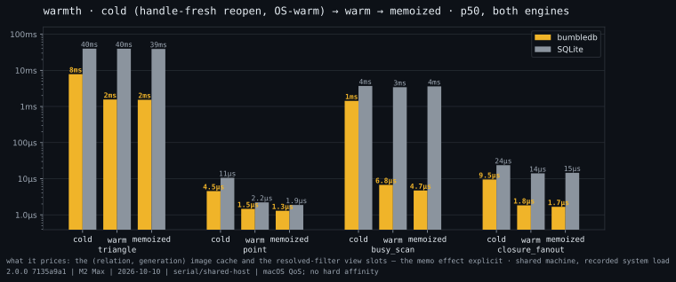

Large populated corpora here do not establish larger-than-memory performance.

## Heap workloads

The heap lane compares a frozen in-memory instance with LMDB access, with
32 samples per point and access workload. It is not an alternative durability
contract. Times are **microseconds**.

| Operation | Heap median | Heap mean | Heap p99 | LMDB median | LMDB mean | LMDB p99 |
|---|---|---|---|---|---|---|
| get | 0.125 | 0.268 | 4.750 | 1.625 | 1.509 | 1.875 |
| contains | 0.167 | 0.174 | 0.209 | 1.167 | 1.165 | 1.250 |
| scan | 20.334 | 20.329 | 23.333 | 27.875 | 28.029 | 33.000 |

| Admission facts | Wall time (ms) | ns/fact |
|---|---|---|
| 693 | 0.281 | 405.42 |
| 2,633 | 1.207 | 458.54 |
| 10,392 | 5.171 | 497.59 |
| 41,432 | 21.866 | 527.75 |

Publication took **488.066 ms**; the 500-row join took **37.375 µs**. These are individual wall measurements, not percentile distributions.

## Synthetic renderer examples

These two images are **renderer test fixtures**, not measurements or captured profiles.
They remain separate from the 21 regenerated benchmark charts.

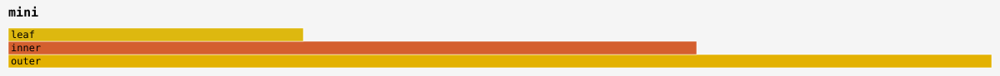

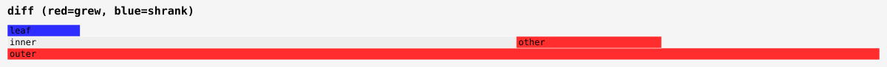

See the [measurement guide](measurement-plan.md) for commands, workload boundaries and
profiling procedures. The [run directory](runs/2.0.0/README.md) holds the inputs
needed to regenerate the charts.
